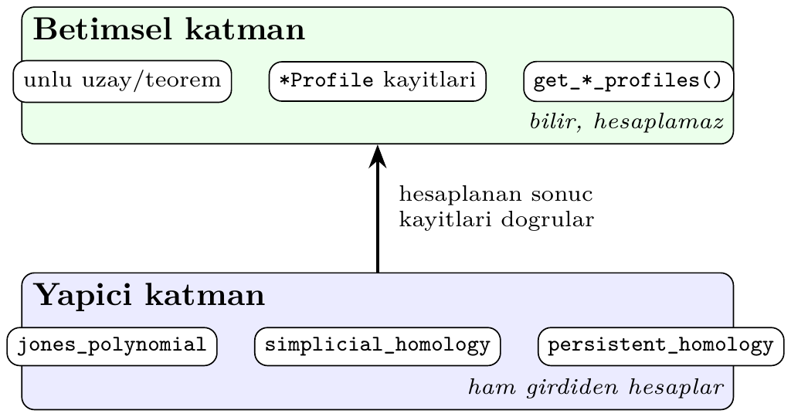
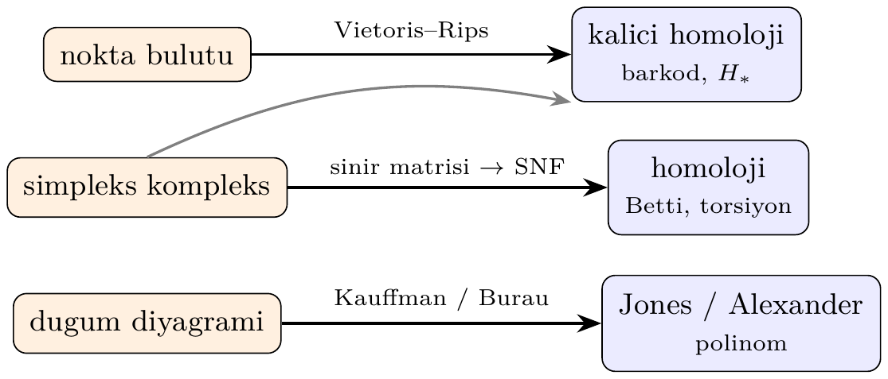

# Bölüm 1 — pytop'a Hızlı Giriş

pytop kurulumu, temel uzay nesneleri, `Result` tipi ve tag sistemi —
kılavuzun geri kalanını okumadan önce bu bölümü çalıştırın.

---

## 1. Kurulum ve Import

```bash
pip install -e .   # git kökünden
```

Her bölümde ihtiyaç duyulan semboller doğrudan `pytop`'tan import edilir.
Bu bölüm bir _tur_ olduğundan, ilk hücrede sonraki tüm hücrelerin kullanacağı
sembolleri tek seferde içe aktarıyoruz:

```python
import pytop
from pytop import (
    discrete_topology, indiscrete_topology, sierpinski_space, make_topology,
    is_compact, is_connected, is_t0, is_t1, is_t2,
    count_topologies_on_n_points,
    simplicial_complex, simplicial_homology, betti_numbers,
    FiniteMetricSpace, persistent_homology, persistence_betti_numbers,
)
from pytop.experimental.spaces import finite_circle, pi1_space
print("pytop surumu:", pytop.__version__)
```

```text
pytop surumu: 1.7.0
```

> 💡 **Sezgi:** pytop'u iki katlı bir bina gibi düşünün. Alt kat **betimsel**
> (descriptive) katmandır: ünlü uzayların ve teoremlerin kayıtlı, kaynaklı
> bilgisini tutar — bilir ama hesaplamaz. Üst kat **yapıcı** (constructive)
> katmandır: ham girdiden invaryantları _hesaplar_ — homoloji, kalıcı homoloji,
> düğüm polinomları. Bu bölüm her iki kata da kısa bir tur attırır; Bölüm 9
> doğrudan hesaplamalı çekirdeğe iner.



> **Neden bu konu?** pytop'un temel nesnelerini tanımadan diğer bölümler okunamaz.

> 🔍 **Kendin dene:** `discrete_topology(0,1,2)` oluşturduktan sonra `topology` listesini elle inceleyerek tüm alt kümelerin açık olup olmadığını sayın.

> ⚠️ **Sık hata:** `r.status == True` yerine `r.status == 'true'` kullanın (dize karşılaştırması).

> ↗️ **Bkz.:** Bölüm 4 (uzay aksiyomları), Bölüm 5 (kapalı kümeler/kapanış).

> 💭 **Öz-yansıtma:** `make_topology`'nin farkı nedir? Neden `Result` bir `bool` değil?

---

## 2. Uzay Nesneleri

| Kurucu | Topoloji | Sonuç |
|--------|----------|-------|
| `discrete_topology(*pts)` | Her altküme açık | Ayrık |
| `indiscrete_topology(*pts)` | Yalnız ∅ ve X açık | İndiscrete |
| `sierpinski_space()` | {∅, {1}, {0,1}} | Sierpiński |
| `make_topology(carrier, *open_sets)` | Kullanıcı tanımlı | Özel |

```python
d = discrete_topology(0, 1, 2)
print("carrier:", sorted(d.carrier))
print("topoloji boyutu:", len(d.topology))
print("etiketler:", sorted(d.tags))
```

```text
carrier: [0, 1, 2]
topoloji boyutu: 8
etiketler: ['discrete', 'finite', 'hausdorff', 'metrizable', 'normal', 'regular']
```

---

## 3. Result Tipi

pytop'un çoğu yüklemi bir `Result` nesnesi döner.

```python
s = sierpinski_space()
r = is_t2(s)
print(".status      :", r.status)        # 'true' | 'false' | 'unknown'
print(".value       :", r.value)
print(".mode        :", r.mode)          # 'exact' | 'corridor' | 'assumed'
print(".justification:", r.justification)
```

```text
.status      : false
.value       : hausdorff
.mode        : exact
.justification: ['The explicit finite topology fails hausdorff.']
```

`.status` her zaman `'true'`, `'false'` veya `'unknown'` **dizesidir** — Python
bool'u değil. Karşılaştırmada `r.status == 'true'` kullanın.

---

## 4. Temel Uzaylar Turu

```python
spaces = {
    "Ayrık D(0,1,2)":     discrete_topology(0, 1, 2),
    "İndiscrete I(0,1,2)": indiscrete_topology(0, 1, 2),
    "Sierpinski S":        sierpinski_space(),
}

print(f"{'Uzay':<22} {'kompakt':>8} {'bağlantılı':>11} {'T0':>4} {'T1':>4} {'T2':>4}")
for name, sp in spaces.items():
    print(f"{name:<22} {is_compact(sp).status:>8} {is_connected(sp).status:>11} "
          f"{is_t0(sp).status:>4} {is_t1(sp).status:>4} {is_t2(sp).status:>4}")
```

```text
Uzay                    kompakt  bağlantılı   T0   T1   T2
Ayrık D(0,1,2)             true       false true true true
İndiscrete I(0,1,2)        true        true false false false
Sierpinski S               true        true true false false
```

---

## 5. Özel Topoloji: make_topology

```python
X = [1, 2, 3, 4]
tau = [set(), {1,2}, {3,4}, {1,2,3,4}]
fts = make_topology(X, *tau)
print("topoloji:", sorted([sorted(list(u)) for u in fts.topology],
                          key=lambda x: (len(x), x)))
print("kompakt:", is_compact(fts).status)
print("T2:", is_t2(fts).status)
```

```text
topoloji: [[], [1, 2], [3, 4], [1, 2, 3, 4]]
kompakt: true
T2: false
```

`make_topology` verilen açık kümelerin birleşim ve kesişim kapatmasını otomatik
tamamlar.

---

## 6. Tag Sistemi

```python
print("Ayrık:     ", sorted(discrete_topology(0,1,2).tags))
print("Indiscrete:", sorted(indiscrete_topology(0,1,2).tags))
print("Sierpinski:", sorted(sierpinski_space().tags))
```

```text
Ayrık:      ['discrete', 'finite', 'hausdorff', 'metrizable', 'normal', 'regular']
Indiscrete: ['compact', 'connected', 'finite', 'indiscrete']
Sierpinski: ['compact', 'connected', 'finite', 't0']
```

Etiketler yüklem fonksiyonlarının karar mekanizmasını hızlandırır:
`is_t2(d)` açık küme taraması yerine `'hausdorff' in d.tags` kontrolüyle sonuç verir.

---

## 7. n Nokta Üzerindeki Topoloji Sayısı

```python
for n in range(1, 5):
    print(f"n={n}: {count_topologies_on_n_points(n)}")
```

```text
n=1: 1
n=2: 4
n=3: 29
n=4: 355
```

---

## 8. pytop Ne Hesaplar? — Genel Harita

Önceki bölümler **betimsel/sonlu** katmanı gezdirdi (uzaylar, etiketler,
yüklemler). pytop'un asıl gücü ise **yapıcı çekirdektir**: ham bir kompleks
ya da nokta bulutundan başlayıp cebirsel invaryantları gerçekten _hesaplar_.
Aşağıdaki harita bir girdinin hangi yollardan invaryanta dönüştüğünü özetler.



---

## 9. Hesaplamalı Çekirdek: İlk Bakış

Bu bölümdeki üç örnek, kılavuzun ileriki bölümlerinin temelini önizler:
sonlu modellerden π₁, ham kompleksten homoloji ve nokta bulutundan kalıcı
homoloji.

### Örnek 9.1 — Sonlu Bir Çember Modeli ve π₁ = ℤ

`finite_circle()` yalnızca 4 noktalı sonlu bir uzaydır, ama McCord düzen
kompleksi üzerinden temel grubu hesaplandığında çıkan sonuç tam da S¹'inkidir:
sonsuz devirli grup ℤ.

```python
fc = finite_circle()
r = pi1_space(fc)
print("uzay adi   :", r.space_name)
print("grup tipi  :", r.group_type)
print("uretec say :", len(r.presentation.generators))
print("baginti say:", len(r.presentation.relators))
print("serbest mi :", r.is_free())
print("H1 betti   :", r.abelianization_betti)
```

```text
uzay adi   : S^1
grup tipi  : infinite_cyclic
uretec say : 1
baginti say: 0
serbest mi : True
H1 betti   : 1
```

Yalnız 4 nokta, hiç bağıntısı olmayan tek üreteç: π₁ = ⟨a⟩ = ℤ. Sonlu bir
topolojik uzay, sürekli bir çemberle aynı temel grubu taşıyabilir — finite
modellerin gücü budur.

### Örnek 9.2 — Üçgen Kenarından Çemberin Homolojisi

Bir üçgenin kenar çerçevesi (içi doldurulmamış) topolojik olarak bir çemberdir.
Köşeleri ve kenarları `simplicial_complex` ile verip homolojiyi hesaplayalım:

```python
circle = simplicial_complex([[0], [1], [2], [0, 1], [1, 2], [0, 2]])
for k in (0, 1):
    h = simplicial_homology(circle, k)
    print(f"H{k}: betti={h.betti} torsion={h.torsion}")
print("betti_numbers:", betti_numbers(circle))
```

```text
H0: betti=1 torsion=()
H1: betti=1 torsion=()
betti_numbers: (1, 1)
```

`H_0 = Z` (tek bağlantılı bileşen), `H_1 = Z` (bir delik). Bu, çemberin klasik
Betti imzası `(1, 1)`'dir — pytop bunu ham simpleks listesinden, tamsayı sınır
matrisi → Smith normal formu yoluyla _hesaplar_.

> ⚠️ **Sık hata:** `simplicial_complex` yüz-kapalı (face-closed) girdi bekler;
> kenarları `[0,1]` verip köşeleri `[0]` eklemeyi unutursanız hata alırsınız.
> Üçgenin kendisini `[0,1,2]` olarak eklerseniz içi dolar ve `H_1 = 0` olur.

### Örnek 9.3 — Nokta Bulutundan Kalıcı Homoloji

Geometrik veriden topolojiye köprü kuran araç **kalıcı homolojidir** (TDA).
Çember üzerinden örneklenmiş 8 noktalık bir bulut alıp, üzerine bir
Vietoris–Rips filtrasyonu kurar ve hangi deliklerin "hayatta kaldığını"
sayarız.

```python
import math

pts = tuple(
    (round(math.cos(2 * math.pi * k / 8), 4),
     round(math.sin(2 * math.pi * k / 8), 4))
    for k in range(8)
)
space = FiniteMetricSpace(carrier=pts, distance=math.dist)
pairs = persistent_homology(space, max_dimension=1, max_scale=1.0)

essential = [p for p in pairs if p.is_essential]
print("toplam cift :", len(pairs))
print("kalici H0   :", sum(1 for p in essential if p.dimension == 0))
print("kalici H1   :", sum(1 for p in essential if p.dimension == 1))
print("betti       :", persistence_betti_numbers(pairs))
```

```text
toplam cift : 9
kalici H0   : 1
kalici H1   : 1
betti       : {0: 1, 1: 1}
```

Kalıcı (essential) sınıflar yine `(1, 1)`'i verir: bir bileşen ve bir delik.
Sadece sıralı noktalardan, hiçbir bağlantı bilgisi vermeden, pytop çemberin
şeklini geri kurtarır — `analyze` etmeden önce veri _gerçekten_ bir çember mi
sorusunu yanıtlayan araç budur.

---

## 10. Alıştırmalar

### Kodlama

K1. `simplicial_complex` ile içi **dolu** üçgeni (`[[0,1,2]]` facet'i, tüm
    yüzleriyle) kurun ve `betti_numbers` çıktısını boş üçgeninkiyle
    karşılaştırın. `H_1` neden kayboldu?

K2. Örnek 9.3'teki nokta sayısını 8'den 4'e düşürün. Kalıcı `H_1` hâlâ `1`
    mi? Çıkan sonucu çemberin örnekleme yoğunluğuyla ilişkilendirin.

### Teori

T1. Sonlu bir uzayın (Örnek 9.1) sürekli bir çemberle aynı π₁'e sahip
    olması nasıl mümkün? McCord teoreminin ne söylediğini bir cümleyle
    açıklayın.

---

## 11. Sıradaki Adım

- **Bölüm 3** — Küme teorisi ve fonksiyon temelleri (matematiksel ön koşullar)
- **Bölüm 4** — Topolojik uzay aksiyomları, baz, alt-baz
- **Bölüm 5** — Açık/kapalı altkümeler, kapanış, iç, sınır
