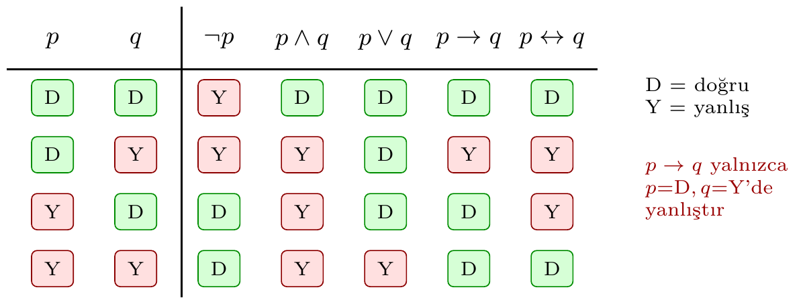
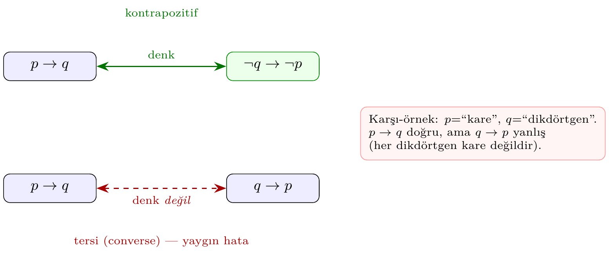

# Bölüm 2 — Önerme Mantığı

Matematiksel önerme (proposition), doğru ya da yanlış olabilen bir ifadedir.
Bu bölüm `pytop.logic` modülünün sağladığı `Proposition`, bağlaçlar ve
sonlu niceleyicileri tanıtır; ardından ayrılma aksiyomlarını bu araçlarla
nasıl ifade edebileceğimizi gösterir.

---

## 1. Önerme ve Doğruluk Değeri

`Proposition(name, truth_value)` isimli bir önerme nesnesi oluşturur.

```python
from pytop import (
    Proposition,
    negate, conjunction, disjunction, implies, iff,
    for_all, there_exists, unique_exists,
)

p = Proposition("p", True)
q = Proposition("q", False)
r = Proposition("r", True)

print(f"p : {p.truth_value}")
print(f"q : {q.truth_value}")
print(f"bool(p): {bool(p)}")
```

```text
p : True
q : False
bool(p): True
```

> **Neden bu konu?** pytop'un yüklem sistemi (`Result`, `status`) sıfır/bir yerine üçlü (true/false/unknown) mantık kullanır; bu bölüm onu açıklar.

> 🔍 **Kendin dene:** `status == 'unknown'` dönen bir yüklem bulup nedenini araştırın.

> ⚠️ **Sık hata:** `not r.value` yerine `r.status == 'false'` ile karşılaştırın.

> ↗️ **Bkz.:** Bölüm 1 (Result tipi), Bölüm 6 (ayırma aksiyomları).

> 💭 **Öz-yansıtma:** `'unknown'` durumu ne zaman ortaya çıkar?

---

## 2. Mantıksal Bağlaçlar

| Fonksiyon | Sembol | Anlam |
|-----------|--------|-------|
| `negate(p)` | ¬p | p değil |
| `conjunction(p, q)` | p ∧ q | p ve q |
| `disjunction(p, q)` | p ∨ q | p veya q |
| `implies(p, q)` | p → q | p ise q |
| `iff(p, q)` | p ↔ q | p ancak ve ancak q |

```python
print("neg(p)     :", negate(p).truth_value)
print("p and q    :", conjunction(p, q).truth_value)
print("p or q     :", disjunction(p, q).truth_value)
print("p -> q     :", implies(p, q).truth_value)
print("p <-> q    :", iff(p, q).truth_value)
print("p <-> p    :", iff(p, p).truth_value)
```

```text
neg(p)     : False
p and q    : False
p or q     : True
p -> q     : False
p <-> q    : False
p <-> p    : True
```

`implies(p, q)` yalnızca `p=True, q=False` durumunda yanlıştır; diğer
üç durumda doğrudur (boş doğruluk / vacuous truth).

Aşağıdaki görsel beş bağlacın dört satırlık doğruluk değerlerini bir arada
özetler: yeşil hücre `doğru` (D), kırmızı hücre `yanlış` (Y) anlamına gelir.



> 💡 **Sezgi:** Bağlaçları "kapı" olarak düşünün. `∧` (ve) her iki girdi de
> doğruyken akım geçirir; `∨` (veya) en az biri doğru olunca geçirir; `→`
> (ise) yalnızca "doğru bir öncülden yanlış bir sonuç" çıkarılırsa kapanır.
> İşte bu yüzden `p → q` sütununda yalnızca tek bir satır (`p`=D, `q`=Y)
> yanlıştır — diğer her şey, mantığın "verdiğin sözü bozmadın" kuralıdır.

> ❌ **Karşı-örnek:** `p → q` ile `p ↔ q` aynı şey değildir. `p`=Y, `q`=D
> alındığında `p → q` **doğru** (D), ama `p ↔ q` **yanlış** (Y) döner: içerme
> tek yönlüdür, çift-koşul iki yönü birden ister. Tabloda 3. satırı karşılaştırın.

---

## 3. Doğruluk Tablosu

```python
print(f"{'p':>5}  {'q':>5}  {'neg_p':>5}  {'p&q':>5}  {'p|q':>5}  {'p->q':>6}  {'p<->q':>6}")
print("-" * 52)
for tv_p in (True, False):
    for tv_q in (True, False):
        pp = Proposition("p", tv_p)
        qq = Proposition("q", tv_q)
        row = (
            pp.truth_value, qq.truth_value,
            negate(pp).truth_value,
            conjunction(pp, qq).truth_value,
            disjunction(pp, qq).truth_value,
            implies(pp, qq).truth_value,
            iff(pp, qq).truth_value,
        )
        print("  ".join(f"{str(v):>5}" for v in row))
```

```text
    p      q  neg_p    p&q    p|q    p->q   p<->q
----------------------------------------------------
 True   True  False   True   True   True   True
 True  False  False  False   True  False  False
False   True   True  False   True   True  False
False  False   True  False  False   True   True
```

---

## 4. Önemli Tautolojiler

Tautoloji: her doğruluk değeri atamasında doğru olan önerme.

### Kontrapozitif ve "tersi" hatası

En sık yapılan mantık hatası, bir içermeyi **tersiyle (converse)** karıştırmaktır.
`p → q`'nin doğru biçimde denk olduğu ifade **kontrapozitiftir**: `¬q → ¬p`.
Buna karşılık `q → p` (tersi) genellikle denk **değildir**.



> ❌ **Karşı-örnek:** `p` = "x bir karedir", `q` = "x bir dikdörtgendir" olsun.
> `p → q` doğrudur (her kare dikdörtgendir), ama tersi `q → p` yanlıştır
> (her dikdörtgen kare değildir). Kontrapozitif `¬q → ¬p` = "dikdörtgen
> değilse kare de değildir" ise yine doğrudur — çünkü o `p → q` ile denktir.

**İspat eskizi (kontrapozitif, doğruluk tablosu kanıtı).** `p → q` ile
`¬q → ¬p` aynı sütunu üretir; dolayısıyla `iff` her satırda `True` döner:

| p | q | p → q | ¬q → ¬p |
|---|---|-------|---------|
| D | D |   D   |    D    |
| D | Y |   Y   |    Y    |
| Y | D |   D   |    D    |
| Y | Y |   D   |    D    |

Dört satırda da iki sütun çakışır, yani `(p → q) ↔ (¬q → ¬p)` bir tautolojidir. ∎

**İspat eskizi (De Morgan, `¬(p ∧ q) ↔ ¬p ∨ ¬q`).** `p ∧ q` yalnızca her ikisi
doğruyken doğrudur; öyleyse `¬(p ∧ q)` "en az biri yanlış" demektir. `¬p ∨ ¬q`
de tam olarak "en az biri yanlış" anlamına gelir. İki taraf her atamada aynı
değeri aldığından denklik tautolojidir:

| p | q | p ∧ q | ¬(p ∧ q) | ¬p ∨ ¬q |
|---|---|-------|----------|---------|
| D | D |   D   |    Y     |    Y    |
| D | Y |   Y   |    D     |    D    |
| Y | D |   Y   |    D     |    D    |
| Y | Y |   Y   |    D     |    D    |

`¬(p ∧ q)` ve `¬p ∨ ¬q` sütunları aynıdır. ∎ İkincil yasa
`¬(p ∨ q) ↔ ¬p ∧ ¬q` de aynı yöntemle (∨ ve ∧ rollerini değiştirerek) gösterilir.

```python
pairs = [(True, True), (True, False), (False, True), (False, False)]

def check_tautology(name, func):
    ok = all(func(Proposition("p", tp), Proposition("q", tq)).truth_value
             for tp, tq in pairs)
    print(f"{name}: {'tautoloji' if ok else 'DEGIL'}")

check_tautology("neg(p&q) <-> neg_p|neg_q",
    lambda p, q: iff(negate(conjunction(p, q)), disjunction(negate(p), negate(q))))
check_tautology("neg(p|q) <-> neg_p&neg_q",
    lambda p, q: iff(negate(disjunction(p, q)), conjunction(negate(p), negate(q))))
check_tautology("(p->q) <-> (neg_q->neg_p)",
    lambda p, q: iff(implies(p, q), implies(negate(q), negate(p))))
```

```text
neg(p&q) <-> neg_p|neg_q: tautoloji
neg(p|q) <-> neg_p&neg_q: tautoloji
(p->q) <-> (neg_q->neg_p): tautoloji
```

---

## 5. Niceleyiciler

```text
for_all(carrier, predicate)       # tum x: P(x)
there_exists(carrier, predicate)  # bazi x: P(x)
unique_exists(carrier, predicate) # tam bir x: P(x)
```

```python
X = [1, 2, 3, 4, 5]

print("for_all(X, x>0)       :", for_all(X, lambda x: x > 0))
print("for_all(X, x>2)       :", for_all(X, lambda x: x > 2))
print("there_exists(X, x>4)  :", there_exists(X, lambda x: x > 4))
print("there_exists(X, x>5)  :", there_exists(X, lambda x: x > 5))
print("unique_exists(X, x==3):", unique_exists(X, lambda x: x == 3))
print("unique_exists(X, x>3) :", unique_exists(X, lambda x: x > 3))
print("unique_exists(X, x>5) :", unique_exists(X, lambda x: x > 5))
```

```text
for_all(X, x>0)       : True
for_all(X, x>2)       : False
there_exists(X, x>4)  : True
there_exists(X, x>5)  : False
unique_exists(X, x==3): True
unique_exists(X, x>3) : False
unique_exists(X, x>5) : False
```

`unique_exists` yalnızca tam bir eleman sayıldığında `True` döner; sıfır
veya birden fazlada `False`.

---

## 6. Topoloji Uygulaması — Ayrılma Aksiyomları

**T0 (Kolmogorov):** $\forall x \neq y \in X,\ \exists$ açık $U : (x \in U, y \notin U)$ veya $(y \in U, x \notin U)$

**T1 (Fréchet):** $\forall x \neq y \in X,\ \exists$ açık $U : x \in U,\ y \notin U$

```python
from pytop import sierpinski_space, discrete_topology, indiscrete_topology

def is_t0_logic(space):
    pts   = list(space.carrier)
    opens = list(space.topology)
    return for_all(
        [(x, y) for x in pts for y in pts if x != y],
        lambda pair: there_exists(
            opens,
            lambda U: (pair[0] in U) != (pair[1] in U)
        )
    )

def is_t1_logic(space):
    pts   = list(space.carrier)
    opens = list(space.topology)
    return for_all(
        [(x, y) for x in pts for y in pts if x != y],
        lambda pair: there_exists(
            opens,
            lambda U: pair[0] in U and pair[1] not in U
        )
    )

spaces = {
    "Sierpinski": sierpinski_space(),
    "Discrete  ": discrete_topology(0, 1),
    "Indiscrete": indiscrete_topology(0, 1),
}

print(f"{'Uzay':<12}  T0     T1")
print("-" * 26)
for name, sp in spaces.items():
    print(f"{name}  {str(is_t0_logic(sp)):<5}  {str(is_t1_logic(sp)):<5}")
```

```text
Uzay          T0     T1
--------------------------
Sierpinski  True   False
Discrete    True   True 
Indiscrete  False  False
```

`for_all`/`there_exists` ile yazılan T0/T1 tanımları, `pytop`'un `is_t0`
ve `is_t1` yüklemlerinin sonuçlarıyla örtüşür. Bu yaklaşım aksiyomun tam
tanımını çalıştırılabilir kod olarak belgeler.

---

## Alıştırmalar

1. Beş önerme değeriyle tam bir doğruluk tablosu oluşturun; `implies` kaç
   `(p, q)` çiftinde `False` döner?

2. `unique_exists([0,1,2,3,4], predicate)` değerini `True` yapan üç farklı
   koşul yazın.

3. T2 (Hausdorff) aksiyomunu `for_all` ve `there_exists` kullanarak tanımlayın:
   $\forall x \neq y,\ \exists$ açık $U, V : x \in U,\ y \in V,\ U \cap V = \emptyset$.
   Bu tanımı Sierpiński, discrete ve indiscrete için test edin.

4. *(Teori)* `implies(p, q)` neden yalnızca `p=True, q=False` durumunda
   yanlıştır? Boş doğruluk (vacuous truth) kavramını açıklayın.

5. *(Teori)* De Morgan yasalarını önerme mantığı için ispatlayın:
   $\neg(p \wedge q) \leftrightarrow \neg p \vee \neg q$.

6. `check_tautology` yardımcı fonksiyonunu kullanarak **dağılma yasasını**
   doğrulayın: $p \wedge (q \vee r) \leftrightarrow (p \wedge q) \vee (p \wedge r)$.
   Üç değişken olduğu için sekiz $(p, q, r)$ atamasının tümünü gezdirmeniz
   gerekir; `iff`'in her atamada `True` döndüğünü gösterin.

7. *(Teori)* Bir öğrenci "$p \to q$ doğruysa $q \to p$ de doğrudur" diyor.
   Bu iddianın neden yanlış olduğunu, kontrapozitif `¬q → ¬p` ile tersi
   `q → p` arasındaki farkı vurgulayan somut bir karşı-örnekle açıklayın.
   (İpucu: $p$ = "tam sayı 4'e bölünür", $q$ = "tam sayı çifttir".)
