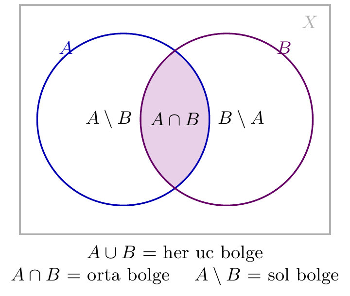
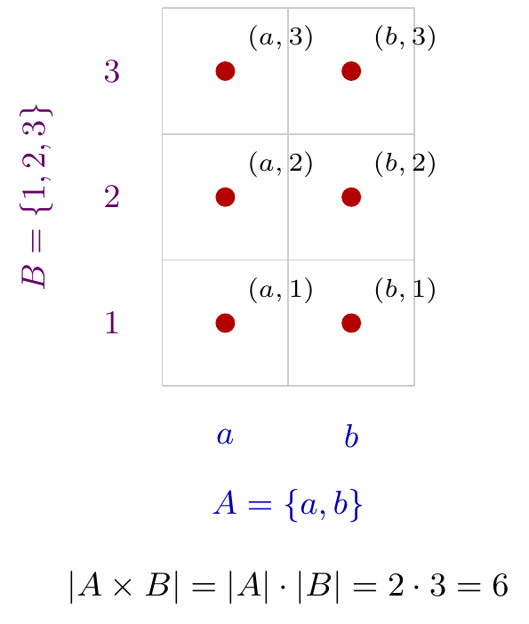

# Bölüm 3 — Küme Teorisi ve Fonksiyon Temelleri

pytop'un tüm modülleri küme teorisi ve fonksiyon kavramları üzerine kuruludur.
Bu bölüm, kılavuzun geri kalanında varsayılan ön koşulları pytop API'siyle birlikte pekiştirir.

---

## 1. Konu

### Küme ve Altküme

Küme: birbirinden ayrı nesnelerin koleksiyonu. Gösterim: A = {1, 2, 3}.
Altküme: A ⊆ B ⟺ her a ∈ A için a ∈ B.
Güç kümesi: P(A) = {S : S ⊆ A}. |P(A)| = 2^|A|.

### Küme İşlemleri

| İşlem | Gösterim | Tanım |
|-------|----------|-------|
| Birleşim | A ∪ B | a ∈ A veya a ∈ B |
| Kesişim | A ∩ B | a ∈ A ve a ∈ B |
| Fark | A \ B | a ∈ A ve a ∉ B |
| Tümleyen | A^c | a ∉ A (evren X'te) |

İki kümenin işlemleri Venn şemasıyla görselleştirilir: A∪B üç bölgenin tamamı,
A∩B ortadaki örtüşen bölge, A\B ise A'nın B'den ayrık kalan kısmıdır.



> 💡 **Sezgi:** Tümleyen her zaman bir **evrene** (X) göre tanımlıdır; "A^c" tek
> başına anlamsızdır. pytop bunu `complement(subset, universe)` imzasıyla
> zorunlu kılar — evren olmadan tümleyen hesaplanamaz.

> ❌ **Karşı-örnek:** "A ∪ B her zaman A'dan büyüktür" yanlıştır. B ⊆ A ise
> A ∪ B = A olur; örneğin A = {1,2,3}, B = {2} için |A ∪ B| = |A| = 3.

### Bağıntılar

Kartezyen çarpım: A × B = {(a, b) : a ∈ A, b ∈ B}.
A üzerinde bir bağıntı R ⊆ A × A.

Kartezyen çarpım, A'nın her elemanını B'nin her elemanıyla eşleştiren sıralı
ikililerin kümesidir; bir ızgara olarak düşünülebilir ve |A × B| = |A| · |B|.



> 💡 **Sezgi:** Bir bağıntı, kartezyen çarpımın bir alt kümesinden başka bir şey
> değildir. Tüm topolojik kavramlar (sıra, denklik, komşuluk) bu basit "ikililer
> kümesi" soyutlaması üzerine kurulur.

> ❌ **Karşı-örnek:** Kartezyen çarpım değişmeli değildir: A × B ile B × A genel
> olarak farklıdır. (a,1) ∈ A × B ama (a,1) ∉ B × A — çünkü B × A'nın ikilileri
> (1,a) biçimindedir.

| Özellik | Koşul |
|---------|-------|
| Yansımalı | ∀a, (a,a) ∈ R |
| Simetrik | (a,b) ∈ R ⟹ (b,a) ∈ R |
| Geçişli | (a,b),(b,c) ∈ R ⟹ (a,c) ∈ R |
| **Denklik** | Yansımalı + Simetrik + Geçişli |

### Fonksiyonlar

f: A → B, her a ∈ A için tek bir f(a) ∈ B.

| Tür | Koşul |
|-----|-------|
| Enjeksiyon | f(a₁) = f(a₂) ⟹ a₁ = a₂ |
| Sürjeksiyon | ∀b ∈ B, ∃a: f(a) = b |
| Bijeksiyon | Enjeksiyon + Sürjeksiyon |

> **Neden bu konu?** Tüm topoloji API'si küme ve bağıntı soyutlamalarına dayanır; bu temeli sağlam kurmadan ilerisi karmaşıklaşır.

> 🔍 **Kendin dene:** `make_set(1,2,3)` ve `frozenset({1,2,3})` arasındaki farkı Python `print()` ile gözlemleyin; tür aynı mı?

> ⚠️ **Sık hata:** `make_relation(carrier, *pairs)`'te `carrier` verilmezse hata alırsınız; her bağıntı tanımında carrier listesini ilk argüman yapın.

> ↗️ **Bkz.:** Bölüm 12 (bölüm topolojisi — `equivalence_class` kullanımı).

> 💭 **Öz-yansıtma:** Bileşim sırasız mı? `compose_relations(R,S)` ile `compose_relations(S,R)` her zaman farklı mı?

---

## 2. Teoremler

**Teorem 2.1 (De Morgan).**
(A ∪ B)^c = A^c ∩ B^c  ve  (A ∩ B)^c = A^c ∪ B^c.

*İspat eskizi.* İki kümenin eşitliğini çift kapsama ile gösteririz.
x ∈ (A ∪ B)^c ⟺ x ∉ A ∪ B ⟺ x ∉ A **ve** x ∉ B (birleşimin tanımının
değillemesi) ⟺ x ∈ A^c ve x ∈ B^c ⟺ x ∈ A^c ∩ B^c. Her adım çift yönlü
olduğundan iki küme tam olarak aynı elemanlara sahiptir. İkinci eşitlik,
"veya"nın değillemesi "ve değil ... ve değil" yerine "ya değil ... ya değil"
ile aynı argümanla elde edilir. ∎

**Teorem 2.2 (Güç Kümesi Boyutu).**
|A| = n ⟹ |P(A)| = 2ⁿ.

*İspat eskizi.* A'nın her S alt kümesi, A'nın n elemanının her biri için
"S içinde mi?" sorusuna evet/hayır cevabı veren bir ikili dizgiyle birebir
eşleşir. n bağımsız ikili seçim olduğundan toplam alt küme sayısı 2 · 2 · … · 2
(n çarpan) = 2ⁿ'dir. Alternatif olarak tümevarım: |A| = 0 için P(∅) = {∅},
|P| = 1 = 2⁰; bir eleman a eklendiğinde her eski alt küme hem a'sız hem a'lı
biçimde sayılır, böylece miktar ikiye katlanır. ∎

**Teorem 2.3 (Denklik Sınıfları Bölüntü Oluşturur).**
~ denklik bağıntısı ise {[a] : a ∈ A} A'nın bir bölüntüsüdür.

**Teorem 2.4 (Ön-Görüntü Özellikleri).**
f⁻¹(S₁ ∪ S₂) = f⁻¹(S₁) ∪ f⁻¹(S₂)  ve  f⁻¹(S₁ ∩ S₂) = f⁻¹(S₁) ∩ f⁻¹(S₂).

---

## 3. Algoritmalar

### Güç Kümesi — O(2^|A|)

```
PowerSet(A):
    result <- {∅}
    for each a in A:
        result <- result ∪ {S ∪ {a} : S ∈ result}
    return result
```

### Denklik Bağıntısı Doğrulama — O(|R| · |A|)

```
IsEquivalence(A, R):
    for each a in A:
        if (a, a) not in R: return False   // yansımalı
    for each (a, b) in R:
        if (b, a) not in R: return False   // simetrik
    for each (a, b) in R:
        for each (b, c) in R:
            if (a, c) not in R: return False  // geçişli
    return True
```

---

## 4. pytop API

```python
from pytop import (
    make_set, power_set, empty_set,
    set_union, set_intersection, set_difference, complement,
    cartesian_product, indexed_union, indexed_intersection,
    is_subset, is_proper_subset, equal_sets,
    make_relation, is_equivalence_relation,
    identity_relation, inverse_relation, compose_relations,
    relation_profile,
    equivalence_class, partition_from_equivalence,
    total_order_from_list, is_partial_order, is_total_order,
    normalize_finite_map_data,
    is_injective_finite_map, is_surjective_finite_map, is_bijective_finite_map,
    image_of_subset_finite, preimage_of_subset_finite,
)
```

`make_set(*elements)` → `frozenset`

`empty_set()` → `frozenset` — boş küme ∅

`power_set(values)` → `set[frozenset]`

`complement(subset, universe)` → `set` — evrene göre tümleyen A^c = X \ A

`cartesian_product(left, right)` → `set[tuple]` — A × B sıralı ikilileri

`indexed_union(family)` / `indexed_intersection(family)` → `set` — indeksli aile birleşim/kesişim

`make_relation(carrier, *pairs)` → `set[tuple]`

`relation_profile(carrier, relation)` → `dict` (is_reflexive, is_symmetric, is_transitive, ...)

`compose_relations(first, second)` → `set[tuple]` — second ∘ first

`equivalence_class(carrier, relation, point)` → `set` — [point] sınıfı

`partition_from_equivalence(carrier, relation)` → `set[frozenset]` — bölüntü blokları

`total_order_from_list(*elements)` → `set[tuple]` — yansımalı toplam sıra

`normalize_finite_map_data(domain, codomain, mapping)` → `FiniteMapData`

---

## 5. Örnekler

### Örnek 5.1 — Küme İşlemleri

```python
A = make_set(1, 2, 3)
B = make_set(2, 3, 4)
print("A union B:", sorted(set_union(A, B)))
print("A inter B:", sorted(set_intersection(A, B)))
print("A diff B:", sorted(set_difference(A, B)))
print("{2,3} subset A:", is_subset({2, 3}, A))
print("{1,4} subset A:", is_subset({1, 4}, A))
```

```text
A union B: [1, 2, 3, 4]
A inter B: [2, 3]
A diff B: [1]
{2,3} subset A: True
{1,4} subset A: False
```

### Örnek 5.2 — Güç Kümesi

```python
P = power_set([1, 2, 3])
print("P({1,2,3}) boyutu:", len(P))
for s in sorted([sorted(list(x)) for x in P], key=lambda x: (len(x), x)):
    print(" ", s if s else "empty")
```

```text
P({1,2,3}) boyutu: 8
  empty
  [1]
  [2]
  [3]
  [1, 2]
  [1, 3]
  [2, 3]
  [1, 2, 3]
```

3 elemanlı A için |P(A)| = 2³ = 8.

### Örnek 5.3 — Denklik Bağıntısı

```python
carrier = [1, 2, 3, 4]
rel_eq = make_relation(carrier, (1,1),(2,2),(3,3),(4,4),(1,3),(3,1),(2,4),(4,2))
print("Denklik bağıntısı mı:", is_equivalence_relation(carrier, rel_eq))
prof = relation_profile(carrier, rel_eq)
print("Yansımalı:", prof['is_reflexive'])
print("Simetrik:", prof['is_symmetric'])
print("Geçişli:", prof['is_transitive'])

rel_not_trans = make_relation(carrier,
    (1,1),(2,2),(3,3),(4,4),(1,2),(2,1),(2,3),(3,2))
print("Geçişsiz bağıntı denklik mi:", is_equivalence_relation(carrier, rel_not_trans))
```

```text
Denklik bağıntısı mı: True
Yansımalı: True
Simetrik: True
Geçişli: True
Geçişsiz bağıntı denklik mi: False
```

İkinci bağıntı geçişli değil: (1,2) ve (2,3) ∈ R ama (1,3) ∉ R.

### Örnek 5.4 — Özdeşlik ve Ters Bağıntı

```python
id_rel = identity_relation([0, 1, 2])
print("Özdeşlik:", sorted(id_rel))

r = make_relation([0,1,2], (0,1),(1,2))
print("R:", sorted(r))
print("R^(-1):", sorted(inverse_relation(r)))
```

```text
Özdeşlik: [(0, 0), (1, 1), (2, 2)]
R: [(0, 1), (1, 2)]
R^(-1): [(1, 0), (2, 1)]
```

### Örnek 5.5 — Fonksiyon Türleri

```python
f_bij = normalize_finite_map_data([1,2,3], ['a','b','c'], {1:'a', 2:'b', 3:'c'})
print("bijeksiyon:", is_bijective_finite_map(f_bij))

f_inj = normalize_finite_map_data([1,2], ['a','b','c'], {1:'a', 2:'b'})
print("enjeksiyon (eksik c):", is_injective_finite_map(f_inj),
      "| sürjeksiyon:", is_surjective_finite_map(f_inj))

f_sur = normalize_finite_map_data([1,2,3], ['x','y'], {1:'x', 2:'x', 3:'y'})
print("sürjeksiyon (çakışan):", is_surjective_finite_map(f_sur),
      "| enjeksiyon:", is_injective_finite_map(f_sur))
```

```text
bijeksiyon: True
enjeksiyon (eksik c): True | sürjeksiyon: False
sürjeksiyon (çakışan): True | enjeksiyon: False
```

### Örnek 5.6 — Görüntü ve Ön-Görüntü

```python
f = normalize_finite_map_data([1,2,3,4], ['a','b','c','d'],
                               {1:'a', 2:'b', 3:'c', 4:'d'})
print("f({1,2}) =", sorted(image_of_subset_finite(f, [1, 2])))
print("f^(-1)({b,c}) =", sorted(preimage_of_subset_finite(f, ['b', 'c'])))
```

```text
f({1,2}) = ['a', 'b']
f^(-1)({b,c}) = [2, 3]
```

---

### Örnek 5.7 — Bağıntı Bileşimi

```python
carrier_c = [1, 2, 3, 4]
R_c = make_relation(carrier_c, (1, 2), (2, 3), (3, 4))
S_c = make_relation(carrier_c, (2, 4), (3, 1), (4, 2))
RS = compose_relations(R_c, S_c)   # S ∘ R
print("R:", sorted(R_c))
print("S:", sorted(S_c))
print("S ∘ R:", sorted(RS))
```

```text
R: [(1, 2), (2, 3), (3, 4)]
S: [(2, 4), (3, 1), (4, 2)]
S ∘ R: [(1, 4), (2, 1), (3, 2)]
```

### Örnek 5.8 — Denklik Sınıfları ve Bölüntü

```python
carrier_e = [0, 1, 2, 3, 4, 5]
rel_mod3 = make_relation(carrier_e,
    (0,0),(1,1),(2,2),(3,3),(4,4),(5,5),
    (0,3),(3,0),(1,4),(4,1),(2,5),(5,2))

print("Denklik mi:", is_equivalence_relation(carrier_e, rel_mod3))
print("[0] =", sorted(equivalence_class(carrier_e, rel_mod3, 0)))
print("[1] =", sorted(equivalence_class(carrier_e, rel_mod3, 1)))
print("[2] =", sorted(equivalence_class(carrier_e, rel_mod3, 2)))
boluntu = partition_from_equivalence(carrier_e, rel_mod3)
print("Bölüntü:", sorted([sorted(b) for b in boluntu]))
```

```text
Denklik mi: True
[0] = [0, 3]
[1] = [1, 4]
[2] = [2, 5]
Bölüntü: [[0, 3], [1, 4], [2, 5]]
```

### Örnek 5.9 — Toplam Sıra

```python
carrier_t = ['a', 'b', 'c', 'd']
total_ord = total_order_from_list(*carrier_t)
print("Toplam sıra çiftleri:", sorted(total_ord))
print("Kısmi sıra mı:", is_partial_order(carrier_t, total_ord))
print("Toplam sıra mı:", is_total_order(carrier_t, total_ord))
```

```text
Toplam sıra çiftleri: [('a', 'a'), ('a', 'b'), ('a', 'c'), ('a', 'd'), ('b', 'b'), ('b', 'c'), ('b', 'd'), ('c', 'c'), ('c', 'd'), ('d', 'd')]
Kısmi sıra mı: True
Toplam sıra mı: True
```

### Örnek 5.10 — De Morgan Yasaları (Tümleyenle Doğrulama)

```python
X = make_set(1, 2, 3, 4, 5, 6)
A = make_set(1, 2, 3)
B = make_set(3, 4, 5)

lhs1 = complement(set_union(A, B), X)
rhs1 = set_intersection(complement(A, X), complement(B, X))
print("(A u B)^c    =", sorted(lhs1))
print("A^c n B^c    =", sorted(rhs1))
print("De Morgan 1 esit mi:", sorted(lhs1) == sorted(rhs1))

lhs2 = complement(set_intersection(A, B), X)
rhs2 = set_union(complement(A, X), complement(B, X))
print("(A n B)^c    =", sorted(lhs2))
print("A^c u B^c    =", sorted(rhs2))
print("De Morgan 2 esit mi:", sorted(lhs2) == sorted(rhs2))
```

```text
(A u B)^c    = [6]
A^c n B^c    = [6]
De Morgan 1 esit mi: True
(A n B)^c    = [1, 2, 4, 5, 6]
A^c u B^c    = [1, 2, 4, 5, 6]
De Morgan 2 esit mi: True
```

`complement(subset, universe)` evrene göre tümleyen alır; iki De Morgan
eşitliği de somut kümelerde Teorem 2.1'i doğrular.

### Örnek 5.11 — Kartezyen Çarpım

```python
P = make_set('a', 'b')
Q = make_set(1, 2, 3)
prod = cartesian_product(P, Q)
print("|P| =", len(P), "| |Q| =", len(Q), "| |PxQ| =", len(prod))
for pair in sorted(prod, key=lambda t: (t[0], t[1])):
    print(" ", pair)
```

```text
|P| = 2 | |Q| = 3 | |PxQ| = 6
  ('a', 1)
  ('a', 2)
  ('a', 3)
  ('b', 1)
  ('b', 2)
  ('b', 3)
```

|P × Q| = |P| · |Q| = 2 · 3 = 6 — yukarıdaki ızgara şekliyle birebir örtüşür.

### Örnek 5.12 — İndeksli Aile: Birleşim ve Kesişim

```python
fam = {0: [1, 2, 3], 1: [2, 3, 4], 2: [3, 4, 5]}
print("indexli birlesim :", sorted(indexed_union(fam)))
print("indexli kesisim  :", sorted(indexed_intersection(fam)))
print("bos kume          :", sorted(empty_set()))
```

```text
indexli birlesim : [1, 2, 3, 4, 5]
indexli kesisim  : [3]
bos kume          : []
```

Üç kümenin ortak tek elemanı 3'tür (her ailede var); birleşim tüm elemanları
toplar. `empty_set()` boş `frozenset` üretir.

---

## 6. Alıştırmalar

### Kodlama

K1. A = {1,2,3,4,5}, B = {3,4,5,6,7} için A∪B, A∩B ve A\B hesaplayın.

K2. {1,2,3,4} için güç kümesini üretin; |P| = 16 olduğunu doğrulayın.

K3. R = {(0,0),(1,1),(2,2),(0,1),(1,0),(1,2),(2,1),(0,2),(2,0)} üzerinde
    `relation_profile` çalıştırın; denklik olup olmadığını kontrol edin.

K4. R = {(1,2),(2,3),(3,1)} ve S = {(1,3),(2,1),(3,2)} için S∘R ve R∘S'yi
    hesaplayın; eşit mi?

K5. {0,1,2,3,4} üzerinde mod-2 denkliğini `make_relation` ile tanımlayın;
    her denklik sınıfını `equivalence_class` ile yazdırın.

K6. X = {1,..,8}, A = {1,2,3,4}, B = {3,4,5,6} için `complement` ve set
    işlemlerini kullanarak her iki De Morgan eşitliğini doğrulayın.

K7. P = {x,y,z}, Q = {0,1} için `cartesian_product` ile P × Q ve Q × P
    üretin; boyutların eşit (|P|·|Q| = 6) ama kümelerin farklı olduğunu
    `equal_sets` ile gösterin.

### Teori

T1. A ⊆ B ⟺ A ∩ B = A olduğunu ispatlayın.

T2. f: A → B ve g: B → C her ikisi de enjeksiyon ise g ∘ f de enjeksiyondur.

T3. (R∘S)⁻¹ = S⁻¹∘R⁻¹ eşitliğini sonlu bir örnek üzerinde doğrulayın.
