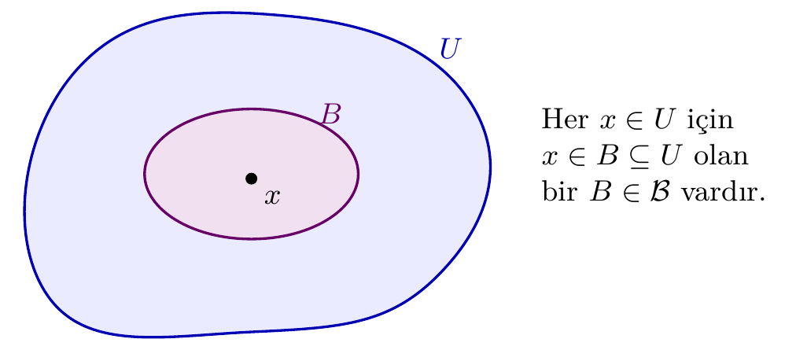
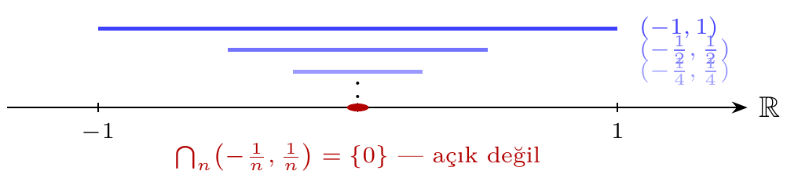
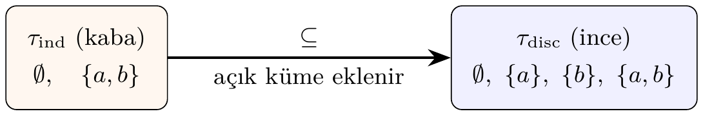
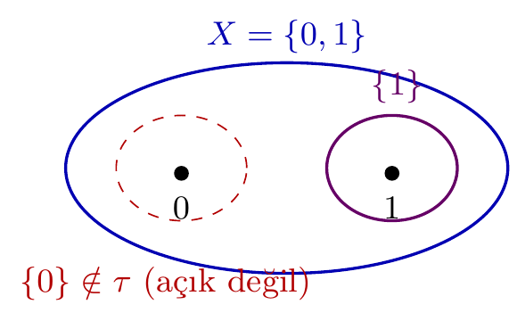

# Bölüm 4 — Topolojik Uzaylar

## 1. Konu

### 1.1 Sezgisel Giriş

Topoloji, bir kümedeki noktaların birbirine "yakın" olup olmadığını, aralarındaki sürekliliği
ve şekilsel özellikleri, mesafe kavramına gerek duymadan inceleyen matematiksel bir disiplindir.
Bunu mümkün kılan temel araç *açık küme* kavramıdır.

Düşünelim: gerçek doğruda $(a, b)$ aralığı "açık"tır; her noktasının çevresinde küçük bir açık
aralık daha bulunur. Bu sezgiyi soyutlayarak *herhangi* bir küme üzerinde topoloji tanımlamak
mümkündür.

> **💡 Sezgi:** Bir şehir haritasında "yakınlık"ı sokak mesafesiyle ölçebilirsiniz; ama "hangi mahalleler birbirine komşu?" sorusu mesafe olmadan da anlamlıdır. Topoloji tam bunu yapar: mesafeyi unutur, yalnızca "hangi kümeler bir noktanın çevresini oluşturur?" bilgisini tutar. Matematiksel karşılığı: $\tau$ ailesi her noktanın "çevre" kavramını açık kümeler aracılığıyla kodlar; süreklilik ve yakınsama gibi kavramlar yalnız $\tau$'ya başvurularak tanımlanır.

### 1.2 Formal Tanım

Bir $X$ kümesi ve $\tau \subseteq \mathcal{P}(X)$ ailesi verilsin.
$(X, \tau)$ bir **topolojik uzay**, $\tau$ ise $X$ üzerinde bir **topoloji** olarak adlandırılır,
eğer aşağıdaki üç aksiyom sağlanıyorsa:

| Aksiyom | İfade |
|---------|-------|
| **(T1)** Trivial kümeler | $\emptyset \in \tau$ ve $X \in \tau$ |
| **(T2)** Sonlu kesişim | $U, V \in \tau \Rightarrow U \cap V \in \tau$ |
| **(T3)** Keyfi birleşim | $\{U_\alpha\}_{\alpha \in I} \subseteq \tau \Rightarrow \bigcup_\alpha U_\alpha \in \tau$ |

$\tau$'nun elemanları **açık küme** olarak adlandırılır.

Aksiyomların her biri ayrı bir iş görür: **(T1)** uzayın tamamının ve boş kümenin her zaman "gözlemlenebilir" olmasını garanti eder; **(T2)** iki gözlemin kesişiminin de gözlem olmasını sağlar — sonlu kesişimle sınırlı kalması bilinçli bir tercihtir; **(T3)** keyfî birleşime izin vererek küçük çevrelerden büyük çevre kurma işlemini serbest bırakır.

> **🚫 Karşı-örnek:** $X=\{1,2,3\}$ üzerinde $\sigma=\{\emptyset,\{1\},\{2\},X\}$ ailesi bir topoloji *değildir*: $\{1\}\cup\{2\}=\{1,2\}\notin\sigma$ olduğundan (T3) ihlal edilir. (T1) ve (T2) sağlansa bile tek bir eksik birleşim aileyi topoloji olmaktan çıkarır.

### 1.3 Temel Örnekler

| Topoloji | Tanım | Açık kümeler |
|----------|-------|--------------|
| **Ayrık (discrete)** | Her alt küme açık | $\tau = \mathcal{P}(X)$ |
| **İndirgenmiş (indiscrete)** | Yalnızca $\emptyset$ ve $X$ açık | $\tau = \{\emptyset, X\}$ |
| **Kosonlu (cofinite)** | $U$ açık ⟺ $U = \emptyset$ veya $X \setminus U$ sonlu | — |
| **Sierpiński** | $X = \{0,1\}$, $\tau = \{\emptyset, \{1\}, X\}$ | 3 açık küme |

### 1.4 Baz ve Alt-Baz

**Baz:** $\mathcal{B} \subseteq \tau$ ailesi, her $U \in \tau$ ve her $x \in U$ için
$x \in B \subseteq U$ sağlayan bir $B \in \mathcal{B}$ varsa $\tau$'ya **baz** denir.

**Baz Koşulları (B1–B2):**
- **(B1)** $\bigcup \mathcal{B} = X$
- **(B2)** $B_1, B_2 \in \mathcal{B}$ ve $x \in B_1 \cap B_2$ ise bir $B_3 \in \mathcal{B}$ vardır:
  $x \in B_3 \subseteq B_1 \cap B_2$



> **🎯 Neden önemli?** Baz, büyük bir topolojiyi küçük bir çekirdekle temsil etme aracıdır. Gerçek doğrunun standart topolojisi sayılamaz çoklukta açık küme içerir; ama tümü, sayılabilir $\{(a,b) : a<b,\ a,b\in\mathbb{Q}\}$ bazından üretilir. `pytop` tarafında `topology_from_basis` tam bu ilkeyle çalışır: yalnız baz elemanlarını verirsiniz, kapanışı kütüphane hesaplar.

**Alt-Baz:** $\mathcal{S} \subseteq \mathcal{P}(X)$ ailesi; sonlu kesişimleri baz, onların birleşimleri
ise $\tau$'yu oluşturur.

### 1.5 Sonlu ve Sonsuz Uzaylar

`pytop`'ta iki temel sınıf bulunur:

- **`FiniteTopologicalSpace`:** Taşıyıcı ($X$) sonlu; topoloji açıkça `frozenset`'ler koleksiyonu
  olarak saklanır. Tüm hesaplamalar tam ve kesindir.
- **`InfiniteTopologicalSpace` türevleri:** Taşıyıcı simgesel (örn. `'R'`, `'N'`); topoloji
  `topology=None` ile gösterilir ve etiket tabanlı sembolik çıkarım yapılır.

> **Neden bu konu?** Topoloji aksiyomları (T1–T3) her şeyin temeli; `make_topology` bunları otomatik tamamlar.

> 🔍 **Kendin dene:** `make_topology([1,2,3], {1})` ile `make_topology([1,2,3], {1},{2})` arasındaki topoloji boyutunu karşılaştırın.

> ⚠️ **Sık hata:** `make_topology` bir alt-baz alıp kapatır; verilen kümeler değil, kapatma sonucu topoloji oluşur.

> ↗️ **Bkz.:** Bölüm 5 (kapanış/iç), Bölüm 10 (süreklilik).

> 💭 **Öz-yansıtma:** Kaç açık küme gördünüz? Alt-baz boyutu ile topoloji boyutu ne zaman eşit olur?

---

## 2. Teoremler

### Teorem 2.1 — Aksiyomların Yeterliliği

**Teorem:** $(X, \tau)$ bir topolojik uzay olsun. T1–T3 aksiyomları, açık kümelerin
herhangi bir ailesinin birleşiminin ve *sonlu* herhangi bir ailesinin kesişiminin
yeniden $\tau$'da olduğunu garanti eder. Özellikle,
$$\bigcap_{i=1}^{n} U_i \in \tau \quad (U_i \in \tau, n < \infty)$$
elde edilir.

**Not:** *Sonsuz* kesişim gerekmez. Gerçek doğruda $\bigcap_{n=1}^{\infty}(-\frac{1}{n}, \frac{1}{n}) = \{0\}$
açık değildir; bu sonsuz kesişimin topolojide yer almak zorunda olmadığını gösterir.



### Teorem 2.2 — Baz Teoremi

**Teorem:** $\mathcal{B} \subseteq \mathcal{P}(X)$ ailesi (B1)–(B2) koşullarını sağlıyorsa,
$$\tau_{\mathcal{B}} = \bigl\{U \subseteq X : \forall x \in U,\, \exists B \in \mathcal{B},\, x \in B \subseteq U\bigr\}$$
bir topoloji olur ve $\mathcal{B}$ bu topolojiye baz oluşturur.

**Rehberli Kanıt:** (T1) ∅ için koşul boş yere doğru; X için (B1) her x'i bir B içine koyar. (T2) x ∈ U∩V için B_U, B_V seç; (B2)'nin verdiği B₃ ⊆ B_U∩B_V ⊆ U∩V. (T3) x ∈ ⋃U_α ise x'in U_α₀'daki baz elemanı birleşim için de iş görür. Bu teorem, `topology_from_basis` çıktısının topoloji olmasının güvencesidir; koşulları sağlamayan aile `BasisConstructionError` ile reddedilir.

### Teorem 2.3 — Karşılaştırma

**Teorem:** $X$ üzerinde iki topoloji $\tau_1 \subseteq \tau_2$ ise $\tau_1$ **kaba (coarser)**,
$\tau_2$ **ince (finer)** topoloji olarak adlandırılır. Ayrık topoloji en ince, indirgenmiş
topoloji en kaba topolojidir.



---

## 3. Algoritmalar

### 3.1 Bazdan Topoloji Üretimi

**Problem:** $X$ ve $\mathcal{B} \subseteq \mathcal{P}(X)$ verilsin; $\tau_{\mathcal{B}}$'yi hesapla.

**Sözde Kod:**

```
BazdenTopoloji(X, B):
    tau ← {∅, X}
    for each alt_aile S ⊆ B (boş olmayan):
        tau.add(⋃ S)          # keyfi birleşim
    tau ← ClosureUnderIntersection(tau)  # sonlu kesişimi kapat
    return tau

ClosureUnderIntersection(tau):
    changed ← true
    while changed:
        changed ← false
        for each U, V ∈ tau:
            if U ∩ V ∉ tau:
                tau.add(U ∩ V)
                changed ← true
    return tau
```

**Karmaşıklık:**
- En kötü durum: $O(|\mathcal{B}| \cdot 2^{|\mathcal{B}|})$ (tüm alt-ailelerin birleşimi)
- Pratik (çakışmayan baz elemanları): $O(|\tau| \cdot |\mathcal{B}|)$
- Uzay: $O(|\tau|)$ açık küme saklar

`pytop`'ta bu işlem `topology_from_basis` / `generate_topology_from_basis` fonksiyonları
aracılığıyla `subbases.py` modülünde gerçekleştirilmektedir.

### 3.2 Alt-Bazdan Topoloji Üretimi

**Problem:** $\mathcal{S}$ verilsin; önce $\mathcal{S}$'nin sonlu kesişimlerinden baz oluştur,
ardından 3.1'i uygula.

**Karmaşıklık:** $O(|\mathcal{S}|^k \cdot 2^{|\mathcal{S}|^k})$ — $k$ kesişim derinliği.

**İz Sürme: Küçük Bir Girdiyle Adım Adım.** $X=\{1,2,3\}$, $\mathcal{B}=\{\{1\},\{2,3\}\}$ girdisiyle "Bazdan Topoloji Üretimi":

| Adım | $\mathcal{S}$ (alt-aile) | Eklenen birleşim | $\tau$ (o ana dek) |
|------|--------------------------|------------------|---------------------|
| 0 | — | — | $\{\emptyset, X\}$ |
| 1 | $\{\{1\}\}$ | $\{1\}$ | $\{\emptyset, X, \{1\}\}$ |
| 2 | $\{\{2,3\}\}$ | $\{2,3\}$ | $\{\emptyset, X, \{1\}, \{2,3\}\}$ |
| 3 | $\{\{1\},\{2,3\}\}$ | $\{1\}\cup\{2,3\}=X$ | değişmez |
| 4 | kesişim kapanışı | $\{1\}\cap\{2,3\}=\emptyset$ | değişmez |

Sonuç: $|\tau|=4$; döngü yeni küme üretmediği anda durur.

---

## 4. pytop API

### 4.1 Sınıflar

```python
from pytop import TopologicalSpace, FiniteTopologicalSpace
```

| Sınıf | Taşıyıcı | Topoloji |
|-------|----------|----------|
| `TopologicalSpace` | `Any` (simgesel veya somut) | `Any` (None olabilir) |
| `FiniteTopologicalSpace` | sonlu `frozenset` | `frozenset[frozenset]` |

`TopologicalSpace` temel sınıftır; `FiniteTopologicalSpace` ondan türer ve otomatik olarak
`"finite"` etiketini taşır.

**Alanlar:**
- `carrier`: Altta yatan küme
- `topology`: Açık kümeler koleksiyonu (veya `None`)
- `tags`: Özellik etiketleri (`set[str]`)
- `metadata`: Ek bilgiler (`dict`)

### 4.2 Oluşturucular

```python
from pytop import (
    make_topology,
    discrete_topology,
    indiscrete_topology,
    cofinite_topology,
    sierpinski_space,
    topology_from_basis,
    topology_from_subbasis,
)
```

| Fonksiyon | İmza | Açıklama |
|-----------|------|----------|
| `make_topology` | `(carrier, *open_sets)` | Açık kümeleri listeleyerek topoloji inşa et |
| `discrete_topology` | `(*elements)` | Ayrık topoloji |
| `indiscrete_topology` | `(*elements)` | İndirgenmiş topoloji |
| `cofinite_topology` | `(*elements)` | Kosonlu topoloji (sonlu X'te ayrıkla çakışır) |
| `sierpinski_space` | `()` | $\{0,1\}$ üzerinde Sierpiński uzayı |
| `topology_from_basis` | `(carrier, basis)` | Bazdan topoloji üret |
| `topology_from_subbasis` | `(carrier, subbasis)` | Alt-bazdan topoloji üret |

### 4.3 Hazır Örnekler

```python
from pytop import finite_chain_space, naturals_cofinite, real_line_metric
```

| Fonksiyon | Döndürür | Açıklama |
|-----------|---------|----------|
| `finite_chain_space(n)` | `FiniteTopologicalSpace` | $n$ noktalı Alexandrov zinciri |
| `naturals_cofinite()` | `CofiniteSpace` | $\mathbb{N}$ kosonlu topoloji |
| `real_line_metric()` | `SymbolicMetricSpace` | $\mathbb{R}$ olağan metrik topoloji |

### 4.4 Tag Sistemi

`pytop` nesneleri `tags` kümesi aracılığıyla topolojik özellikler taşır. Örnek etiketler:
`"finite"`, `"discrete"`, `"t0"`, `"t1"`, `"hausdorff"`, `"compact"`, `"connected"`,
`"metric"`, `"separable"`, `"second_countable"`.

**Tag Gerekçeleri.** Etiketler, kurucunun (constructor) inşa anında *garanti ettiği* gerçeklerdir:

| Kurucu | Etiketler | Gerekçe |
|--------|-----------|---------|
| `sierpinski_space()` | compact, connected, finite, t0 | Sonlu ⇒ kompakt; $\{1\}$ tek yönlü ayırır ⇒ T0 (T1 değil); $X$ iki ayrık boş olmayan açığa bölünemez ⇒ bağlantılı |
| `discrete_topology(1,2,3)` | discrete, finite, hausdorff, metrizable, normal, regular | Her tekil açık ⇒ tüm ayrılma aksiyomları; 0–1 metriği ayrık topolojiyi üretir |
| `indiscrete_topology(1,2,3)` | compact, connected, finite, indiscrete | Tek parçalanamaz yapı: açık yalnız $\emptyset$ ve $X$ |
| `cofinite_topology('a','b','c')` | cofinite, compact, finite, t1 | Tekiller kapalı ⇒ T1 |
| `make_topology(...)`, `finite_chain_space(n)` | finite | Özellik çıkarımı yapılmaz; yalnız sonluluk işaretlenir |

Etiketler *eksiksiz değildir*: `cofinite_topology('a','b','c')` aslında ayrıktır ve Hausdorff'tur ($2^3=8$ açık), ama `discrete`/`hausdorff` etiketi taşımaz — `is_t2` yüklemi yine `true` döner. Kesin sorgu için Bölüm 6'daki `is_*` yüklemlerini kullanın; etiket, yüklemin yerine geçmez.

---

## 5. Örnekler

### Örnek 5.1 — Sierpiński Uzayı

```python
from pytop import sierpinski_space

s = sierpinski_space()
print("Taşıyıcı:", s.carrier)
print("Topoloji:", sorted(str(t) for t in s.topology))
print("Etiketler:", sorted(s.tags))
```

```text
Taşıyıcı: frozenset({0, 1})
Topoloji: ['frozenset()', 'frozenset({0, 1})', 'frozenset({1})']
Etiketler: ['compact', 'connected', 'finite', 't0']
```

**Ne oldu?** Çıktıdaki üç satırı tek tek okuyalım. `Tasiyici` satırı $X=\{0,1\}$'i verir. `Topoloji` satırındaki üç küme tam olarak tanımın istediği yapıdır: $\emptyset$ ve $X$ (T1), tek ek açık küme $\{1\}$. `Etiketler` satırında `t0` var ama `t1` yok: $1$'i içerip $0$'ı dışlayan açık küme vardır ($\{1\}$), fakat $0$'ı içerip $1$'i dışlayan açık küme yoktur — T0 sağlanıp T1'in sağlanmamasının kaynağı budur.



### Örnek 5.2 — Ayrık Topoloji

```python
from pytop import discrete_topology

d = discrete_topology(1, 2, 3)
print("|τ| =", len(d.topology))      # 2^3 = 8
print("Etiketler:", sorted(d.tags))
```

```text
|τ| = 8
Etiketler: ['discrete', 'finite', 'hausdorff', 'metrizable', 'normal', 'regular']
```

**Ne oldu?** $n=3$ eleman için $|\tau|=2^3=8$: her alt küme açıktır. Her tekil küme açık olduğundan herhangi iki nokta kendi tekil komşuluklarıyla ayrılır — `hausdorff`, `normal`, `regular` etiketlerinin kaynağı budur. `metrizable` etiketi 0–1 metriğinden gelir. Listede `compact` yok; ama `is_compact` yüklemi `true` döner — etiketler ile yüklemler arasındaki bu fark için "Tag Gerekçeleri" tablosuna bakın.

### Örnek 5.3 — `make_topology` ile Manuel İnşa

```python
from pytop import make_topology

sp = make_topology({1, 2, 3}, {1}, {2, 3})
print("|τ| =", len(sp.topology))
print("Açık kümeler:", sorted(str(t) for t in sp.topology))
```

```text
|τ| = 4
Açık kümeler: ['frozenset()', 'frozenset({1})', 'frozenset({2, 3})', 'frozenset({1, 2, 3})']
```

**Ne oldu?** `make_topology` verilen $\{1\}$ ve $\{2,3\}$ açıklarına yalnızca $\emptyset$ ve $X$'i ekledi; $|\tau|=4$. Bu örnekte şans eseri sonuç geçerli bir topolojidir, çünkü verilen iki küme ayrıktır. `make_topology` kapanışları *hesaplamaz* — aşağıdaki uyarıya bakın.

> **⚠️ Dikkat — sık hata:** `make_topology` verdiğiniz aileye yalnızca $\emptyset$ ve $X$'i ekler; birleşim/kesişim kapanışını **hesaplamaz** ve aksiyomları **denetlemez**. Kapanışın hesaplanmasını istiyorsanız `topology_from_basis` kullanın — o, baz koşullarını sağlamayan aileyi `BasisConstructionError` ile reddeder.

```python
from pytop import make_topology, topology_from_basis

sessiz = make_topology({1, 2, 3}, {1}, {2})   # denetlemez, kapanis hesaplamaz
print("make_topology:", sorted(sorted(t) for t in sessiz.topology))

try:
    topology_from_basis({1, 2, 3}, [{1}, {2}])  # B1 ihlali: 3 ortulmuyor
except Exception as e:
    print("topology_from_basis:", type(e).__name__)
```

Çıktı:
```text
make_topology: [[], [1], [1, 2, 3], [2]]
topology_from_basis: BasisConstructionError
```

### Örnek 5.4 — Alexandrov Zincir Uzayı

```python
from pytop import finite_chain_space

c = finite_chain_space(3)
print("Taşıyıcı:", c.carrier)
print("Topoloji:", sorted(str(t) for t in c.topology))
```

```text
Taşıyıcı: (1, 2, 3)
Topoloji: ['set()', '{1, 2, 3}', '{1, 2}', '{1}']
```

**Ne oldu?** Çıktıdaki açıklar tam bir "önek merdiveni"dir: $\emptyset\subset\{1\}\subset\{1,2\}\subset\{1,2,3\}$. Alexandrov zincir uzayında $1$ noktası her boş olmayan açıkta yer alır ("en açık" nokta), $3$ ise yalnız $X$'te görünür.

### Örnek 5.5 — Bazdan Topoloji Üretimi

```python
from pytop import topology_from_basis

b = [{1}, {2, 3}, {4}]
ts = topology_from_basis({1, 2, 3, 4}, b)
print("Baz:", [set(x) for x in b])
print("|τ| =", len(ts.topology))
print("Topoloji:", sorted(str(t) for t in ts.topology))
```

```text
Baz: [{1}, {2, 3}, {4}]
|τ| = 8
Topoloji: ['set()', '{1, 2, 3, 4}', '{1, 2, 3}', '{1, 4}', '{1}', '{2, 3, 4}', '{2, 3}', '{4}']
```

**Ne oldu?** Baz $\{\{1\},\{2,3\},\{4\}\}$ bir bölüntüdür: elemanları ikişer ikişer ayrıktır. (B2) koşulu boş yere sağlanır ve topoloji tüm alt-aile birleşimlerinden oluşur: $2^3=8$ açık küme.

### Örnek 5.6 — Sonsuz Uzay: Gerçek Doğru

```python
from pytop import real_line_metric

rl = real_line_metric()
print("Taşıyıcı:", rl.carrier)
print("Etiketler:", sorted(rl.tags))
```

```text
Taşıyıcı: R
Etiketler: ['complete', 'connected', 'first_countable', 'hausdorff', 'infinite',
            'lindelof', 'metric', 'not_compact', 'path_connected', 'second_countable',
            'separable', 't0', 't1', 'uncountable']
```

**Ne oldu?** `Tasiyici: R` satırı taşıyıcının *simgesel* olduğunu söyler: gerçek doğrunun noktaları bellekte tutulmaz, `topology=None`'dır. Tüm topolojik bilgi etiketlerde kodlanmıştır. Sonlu uzaylardaki "hesapla ve doğrula" yaklaşımının yerini burada "bilinen teoremleri etiketle" yaklaşımı alır.

---

## 6. Alıştırmalar

### Kodlama Alıştırmaları

**K1.** `cofinite_topology('a','b','c')` ile üç noktalı kosonlu uzayı kurun; topolojisini ve etiketlerini yazdırın, `is_t1` ve `is_t2` ile test edin. Gözlem: sonlu bir kümede kosonlu topoloji ayrık topolojiyle çakışır. T1 olup Hausdorff olmayan bir örnek için taşıyıcının neden sonsuz olması gerektiğini bir cümleyle açıklayın.
*İpucu: $|\tau|=2^3$ çıkacak; anahtar, Bölüm 6'daki "Sonlu T1 ⟺ Ayrık" teoremidir.*
*(Çözüm: [solutions.md](solutions.md) → Bölüm 4 / K1)*

**K2.** `topology_from_subbasis({1,2,3,4}, [{1,2},{3,4},{2,3}])` çağrısının ürettiği topolojinin kaç açık küme içerdiğini ve hangi açık kümelerden oluştuğunu bulun.
*İpucu: Önce alt-baz çiftlerinin kesişimlerini elle listeleyin ($\{2\}$, $\{3\}$, $\emptyset$); sonra birleşimleri sayın.*
*(Çözüm: [solutions.md](solutions.md) → Bölüm 4 / K2)*

**K3.** `finite_chain_space(5)` oluşturun. Kaç açık küme var? Hangi nokta "en açık"?
*İpucu: Açıklar önek yapısındadır; "en açık" nokta her boş olmayan açıkta bulunandır.*
*(Çözüm: [solutions.md](solutions.md) → Bölüm 4 / K3)*

### Teori Alıştırmaları

**T1.** $X=\{1,2,3\}$ üzerinde kaç farklı topoloji tanımlanabilir? Baz teoremini doğrudan saymak yerine neden kullanmak pratiktir?
*İpucu: Aday aile sayısı $2^{2^3}=256$'dır; cevap 29. Baz teoremi adayları üretken küçük ailelere indirger.*
*(Çözüm: [solutions.md](solutions.md) → Bölüm 4 / T1)*

**T2.** Ayrık topolojinin her zaman en ince, indirgenmiş topolojinin en kaba olduğunu T1–T3 aksiyomlarını kullanarak kanıtlayın.
*İpucu: Ayrıklık için aksiyom gerekmez ($\tau\subseteq\mathcal{P}(X)$ tanım gereğidir); indirgenmişlik için yalnız (T1) yeter.*
*(Çözüm: [solutions.md](solutions.md) → Bölüm 4 / T2)*
