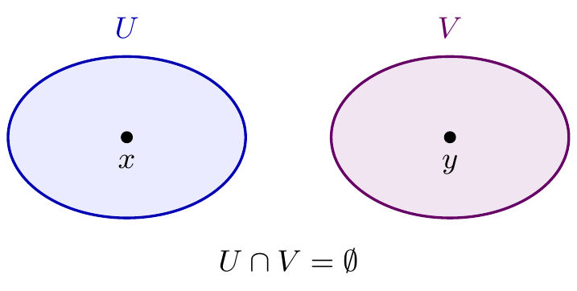
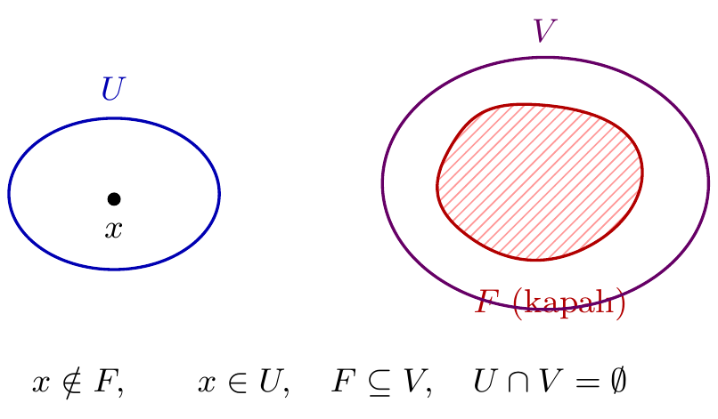
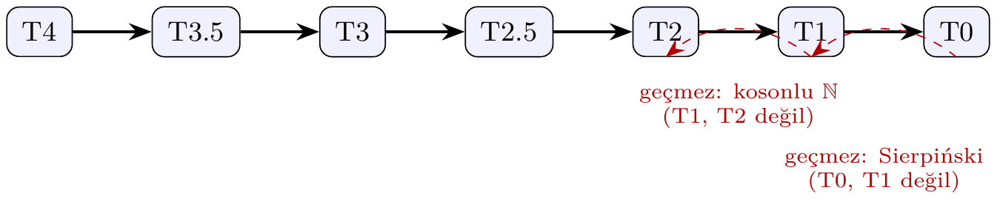
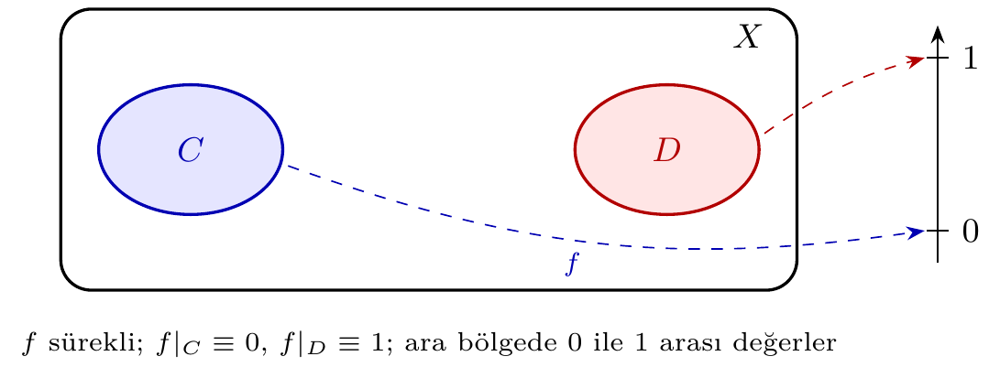

# Bölüm 6 — Ayrılma Aksiyomları

## 1. Konu

Ayrılma aksiyomları, bir topolojik uzaydaki noktaların ve kapalı kümelerin birbirinden
açık kümeler aracılığıyla ne ölçüde "ayrılabildiğini" ölçer.

> **💡 Sezgi:** Ayrılma aksiyomlarını bir mikroskobun çözünürlük kademeleri gibi düşünün: T0'da iki noktayı *en az bir yönden* ayırt edebilirsiniz; T1'de her iki yönden; T2'de noktaları çakışmayan iki ayrı "görüş alanına" koyabilirsiniz; T3 ve T4'te artık nokta–kapalı küme ve kapalı–kapalı çiftleri bile ayrışır.

### 1.1 Aksiyomlar Tablosu

| Aksiyom | İsim | Koşul |
|---------|------|-------|
| **T0** | Kolmogorov | $\forall x \neq y$: $\exists U \in \tau$, $x \in U, y \notin U$ veya tersi |
| **T1** | Fréchet | $\forall x \neq y$: $\exists U, V \in \tau$, $x \in U \setminus V$, $y \in V \setminus U$ |
| **T2** | Hausdorff | $\forall x \neq y$: $\exists U, V \in \tau$, $x \in U$, $y \in V$, $U \cap V = \emptyset$ |
| **T2.5** | Urysohn | $\forall x \neq y$: $\exists U, V \in \tau$, $x \in U$, $y \in V$, $\overline{U} \cap \overline{V} = \emptyset$ |
| **T3** | Regüler | T1 + $\forall x$, kapalı $C \not\ni x$: $\exists U, V \in \tau$, $x \in U$, $C \subseteq V$, $U \cap V = \emptyset$ |
| **T3.5** | Tychonoff | T1 + $\forall x$, kapalı $C \not\ni x$: $\exists f: X \to [0,1]$ sürekli, $f(x)=0$, $f|_C=1$ |
| **T4** | Normal | T1 + $\forall C, D$ kapalı, $C \cap D = \emptyset$: $\exists U, V \in \tau$, $C \subseteq U$, $D \subseteq V$, $U \cap V = \emptyset$ |
| **Tamamen normal** | Completely normal | Kalıtsal T4 |
| **Mükemmel normal** | Perfectly normal | T4 + kapalı kümeler $G_\delta$ |

**Sıralama:** T4 $\Rightarrow$ T3.5 $\Rightarrow$ T3 $\Rightarrow$ T2.5 $\Rightarrow$ T2 $\Rightarrow$ T1 $\Rightarrow$ T0

> **⚠️ Dikkat — sık hata:** T3 ve T4'ün tanımı kaynaktan kaynağa değişir. Bu kılavuzda ve `pytop`'ta: **T3 = T1 + regüler, T4 = T1 + normal**. Fark gerçektir: iki noktalı indirgenmiş uzay regüler *ve* normaldir, ama T1 olmadığından T3 de T4 de değildir.

```python
from pytop import two_point_indiscrete_space, is_regular, is_normal, is_t3, is_t4

tp = two_point_indiscrete_space()
print("regular:", is_regular(tp).status, "| normal:", is_normal(tp).status)
print("t3     :", is_t3(tp).status, "| t4    :", is_t4(tp).status)
```

```text
regular: true | normal: true
t3     : false | t4    : false
```





> **🚫 Karşı-örnek:** Hiçbir ayrılma aksiyomunu sağlamayan uzay: iki noktalı indirgenmiş uzay. Açıklar yalnız $\emptyset$ ve $X$ olduğundan iki noktayı ayıran *hiçbir* açık yoktur — uzay T0 bile değildir.

---

## 2. Teoremler

**Teorem 2.1 (Ayrılma Zinciri).**
T4 $\Rightarrow$ T3.5 $\Rightarrow$ T3 $\Rightarrow$ T2.5 $\Rightarrow$ T2 $\Rightarrow$ T1 $\Rightarrow$ T0.
Tersi genel olarak doğru değildir.

**Rehberli Kanıt (model halka, T2 ⇒ T1):** $x\neq y$ için ayrık $U\ni x$, $V\ni y$ al; $U\cap V=\emptyset$ olduğundan $y\notin U$ ve $x\notin V$ — iki yönlü ayrım hazır. T1 ⇒ T0: iki yönlü ayrım tek yönlüyü içerir. Kalan halkalar Alıştırma T1'de.



**Teorem 2.2 (Urysohn Fonksiyon Teoremi).**
$X$ normal ise ve $C, D$ disjoint kapalı kümeler ise, $f: X \to [0,1]$ sürekli bir fonksiyon
vardır: $f|_C \equiv 0$, $f|_D \equiv 1$.



**Teorem 2.3 (Tietze Genişleme Teoremi).**
$X$ normal ise her kapalı $A \subseteq X$ üzerinde $f: A \to [a,b]$ süreklisi
tüm $X$'e sürekli genişletilebilir.

**Teorem 2.4 (Tychonoff Karakterizasyonu).**
$X$, T3.5'tir $\iff$ $X$, bir küp $[0,1]^I$'nın içine homeomorf gömülebilir.

**Teorem 2.5 (Sonlu T1 ⟺ Ayrık).**
Sonlu bir uzayda T1 $\iff$ ayrık topoloji.

**Rehberli Kanıt:**
1. (⇒) T1 gereği her $y\neq x$ için $y\in U_y$, $x\notin U_y$ olan açık $U_y$ vardır; $X\setminus\{x\}=\bigcup_{y\neq x}U_y$ açıktır, yani $\{x\}$ kapalıdır.
2. Herhangi $A\subseteq X$, *sonlu* sayıda tekilin birleşimi olarak kapalıdır.
3. Her $A$ kapalı ise her $X\setminus A$ açıktır; topoloji ayrıktır.
4. (⇐) Ayrık topolojide her $\{x\}$ açıktır; $x\neq y$ çifti $\{x\}$ ve $\{y\}$ ile iki yönlü ayrılır.

Sonsuzlukta 2. adım çöker: sonsuz birleşim kapalılığı korumaz — kosonlu $\mathbb{N}$ tam bu nedenle T1 olup ayrık değildir.

---

## 3. Algoritmalar

### 3.1 Sonlu T0 Karar Prosedürü

```
KontrolT0(X, τ):
    for each pair (x, y) with x ≠ y:
        if not (∃U∈τ: x∈U ∧ y∉U) and not (∃U∈τ: y∈U ∧ x∉U):
            return False
    return True
```

**Karmaşıklık:** $O(|X|^2 \cdot |\tau|)$.

### 3.2 Sonlu T2 (Hausdorff) Karar Prosedürü

```
KontrolT2(X, τ):
    for each pair (x, y) with x ≠ y:
        if not ∃ U,V∈τ: x∈U ∧ y∈V ∧ U∩V=∅:
            return False
    return True
```

**Karmaşıklık:** $O(|X|^2 \cdot |\tau|^2)$.

### 3.3 check_tychonoff — 5-Katmanlı Prosedür

1. T3'ü doğrula
2. `completely_regular` tanığı ara
3. T3.5 onaylama (T3 + completely_regular)
4. Etiket tabanlı geri çekilme
5. Sonuç döndür

**İz Sürme: T0 Prosedürü Sierpiński Üzerinde.** $X=\{0,1\}$, $\tau=\{\emptyset,\{1\},X\}$:

| Çift $(x,y)$ | Denenen $U$ | $x\in U \wedge y\notin U$? | $y\in U \wedge x\notin U$? | Karar |
|--------------|-------------|------------------------------|------------------------------|-------|
| $(0,1)$ | $\emptyset$ | hayır | hayır | devam |
| $(0,1)$ | $\{1\}$ | hayır | **evet** | çift ayrıldı |
| — | — | — | — | tüm çiftler bitti → **true** |

Tek çift tek açıkla ayrıldığından prosedür $O(1)$ adımda biter; genel sınır $O(|X|^2\cdot|\tau|)$'dur.

---

## 4. pytop API

```python
from pytop import (
    is_t0, is_t1, is_t2, is_t2_5, is_t3, is_t4,
    is_hausdorff, is_regular, is_normal, is_perfectly_normal,
    separation_chain, analyze_separation,
)
```

| Fonksiyon | İmza | Döndürür |
|-----------|------|---------|
| `is_t0` … `is_t4` | `(space)` | `Result` |
| `is_hausdorff` | `(space)` | `Result` |
| `is_regular` | `(space)` | `Result` |
| `is_normal` | `(space)` | `Result` |
| `is_perfectly_normal` | `(space)` | `Result` |
| `separation_chain` | `(space)` | `dict[str, Result]` |
| `analyze_separation` | `(space, property='hausdorff')` | `Result` |

**`separation_chain` döndürür:** `{'t0': Result, 't1': Result, 'hausdorff': Result, ...}` — her aksiyom için ayrı `Result`.

**`analyze_separation(space, prop)` döndürür:** `Result` — `status='true'` ise uzay `prop`'u sağlar.

> **🎯 Neden önemli?** `is_*` yüklemleri ham `bool` değil, `.status` alanı `true` / `false` / `unknown` olabilen bir `Result` döndürür. Üçüncü değer dürüstlüktür: ör. T3.5 (Tychonoff) sürekli fonksiyonlarla tanımlanır ve sonlu açık-küme taramasıyla karar verilemez; `separation_chain` bu durumda `tychonoff: unknown` raporlar.

---

## 5. Örnekler

### Örnek 5.1 — Sierpiński: T0 ✓, T1 ✗

```python
from pytop import sierpinski_space, is_t0, is_t1, is_t2

s = sierpinski_space()
print("T0:", is_t0(s).status)
print("T1:", is_t1(s).status)
print("T2:", is_t2(s).status)
```

```text
T0: true
T1: false
T2: false
```

**Ne oldu?** `T0: true` — $(0,1)$ çifti için $\{1\}$ açığı $1$'i içerir, $0$'ı dışlar. `T1: false` — ters yön yok: $0$'ı içerip $1$'i dışlayan açık küme yoktur. Sierpiński, zincirin "T0'da takılan" kanonik örneğidir.

### Örnek 5.2 — İndirgenmiş: Hiçbir T Aksiyomu Yok

```python
from pytop import indiscrete_topology, is_t0, is_t1

ind = indiscrete_topology('a', 'b')
print("T0:", is_t0(ind).status)
print("T1:", is_t1(ind).status)
```

```text
T0: false
T1: false
```

**Ne oldu?** $\tau = \{\emptyset, X\}$; $a$ ve $b$'yi birbirinden ayıran açık küme yoktur — T0 bile sağlanamaz.

### Örnek 5.3 — Kosonlu $\mathbb{N}$: T1 ✓, T2 ✗

```python
from pytop import naturals_cofinite, is_t0, is_t1, is_t2

nc = naturals_cofinite()
print("T0:", is_t0(nc).status)
print("T1:", is_t1(nc).status)
print("T2:", is_t2(nc).status)
```

```text
T0: true
T1: true
T2: false
```

**Ne oldu?** `T1: true` — her $n$ için $\mathbb{N}\setminus\{n\}$ kosonludur, dolayısıyla açıktır. `T2: false` — boş olmayan iki kosonlu açık daima kesişir: $\mathbb{N}$ sonsuz olduğundan $U\cap V\neq\emptyset$. Bu örnek, Bölüm 4 K1'in "neden sonsuz taşıyıcı gerekir" sorusunun cevabıdır.

### Örnek 5.4 — Ayrılma Zinciri: Ayrık Topoloji

```python
from pytop import discrete_topology, separation_chain

d = discrete_topology(1, 2, 3)
chain = separation_chain(d)
for prop, result in chain.items():
    print(f"  {prop:20s}: {result.status}")
```

```text
  t0                  : true
  t1                  : true
  hausdorff           : true
  urysohn             : true
  t3                  : true
  tychonoff           : true
  t4                  : true
  completely_normal   : true
  perfectly_normal    : true
```

**Ne oldu?** Ayrık uzayda her tekil açık olduğundan her ayırma görevi tekil komşuluklarla çözülür; dokuz yüklemin tümü `true` döner. `separation_chain`'in anahtar sırası zincirin mantıksal sırasıdır — bir uzayın "nerede takıldığını" yukarıdan aşağı okuyabilirsiniz.

### Örnek 4.5 — Regüler Ama T3 Değil: Konvansiyon Testi

```python
from pytop import two_point_indiscrete_space, is_regular, is_normal, is_t3, is_t4

tp = two_point_indiscrete_space()
print("regular:", is_regular(tp).status, "| normal:", is_normal(tp).status)
print("t3     :", is_t3(tp).status, "| t4    :", is_t4(tp).status)
```

Çıktı:

```text
regular: true | normal: true
t3     : false | t4    : false
```

**Ne oldu?** İndirgenmiş iki noktalı uzayda kapalı kümeler yalnız $\emptyset$ ve $X$'tir; ayırma koşullarının öncülü hiç gerçekleşmez, koşullar boş yere sağlanır: `regular` ve `normal` `true`. Ama uzay T1 olmadığından `t3` ve `t4` `false` kalır.

### Örnek 5.5 — Sierpiński Zinciri

```python
from pytop import sierpinski_space, separation_chain

s = sierpinski_space()
for prop, result in separation_chain(s).items():
    print(f"  {prop:20s}: {result.status}")
```

```text
  t0                  : true
  t1                  : false
  hausdorff           : false
  urysohn             : false
  t3                  : false
  tychonoff           : unknown
  t4                  : false
  completely_normal   : false
  perfectly_normal    : false
```

**Çıktı Açıklaması:** Sierpiński yalnızca T0'ı sağlar. `tychonoff: unknown` — tam regülerlik
sonlu uzayda kesin olarak belirlenemiyor (sembolik çıkarım sınırı); bu değerin anlamı için "Neden önemli?" kutusuna bakın.

### Örnek 5.6 — analyze_separation

```python
from pytop import discrete_topology, sierpinski_space, real_line_metric, analyze_separation

d = discrete_topology(1, 2, 3)
s = sierpinski_space()
rl = real_line_metric()

print("Real line Hausdorff?:", analyze_separation(rl).status)
print("Discrete Hausdorff? :", analyze_separation(d).status)
print("Sierpinski Hausdorff?:", analyze_separation(s).status)
print("Sierpinski T0?       :", analyze_separation(s, 't0').status)
```

```text
Real line Hausdorff?: true
Discrete Hausdorff? : true
Sierpinski Hausdorff?: false
Sierpinski T0?       : true
```

**Çıktı Açıklaması:** `analyze_separation(space, property)` tek bir aksiyom için sorgu yapar.
Varsayılan `'hausdorff'`'tur. `status='true'` → uzay o aksiyomu sağlar; sonuçlar "Neden önemli?" kutusundaki `Result` türüyle döner.

---

## 6. Alıştırmalar

### Kodlama Alıştırmaları

**K1.** `cofinite_topology('a','b','c')` ile üç noktalı kosonlu uzayı kurun; topolojisini ve etiketlerini yazdırın, `is_t1` ve `is_t2` ile test edin. Gözlem: sonlu bir kümede kosonlu topoloji ayrık topolojiyle çakışır. T1 olup Hausdorff olmayan bir örnek için taşıyıcının neden sonsuz olması gerektiğini açıklayın.
*İpucu: Önce açıkları listeleyin: $\emptyset,\{1\},\{2\},\{1,2\},X$.*
*(Çözüm: [solutions.md](solutions.md) → Bölüm 6 / K1)*

**K2.** `finite_chain_space(3)` üzerinde en yüksek sağlanan aksiyomu bulun.
*İpucu: Çıktıda `true` olan en güçlü anahtarı arayın; `unknown` değerlerini "Neden önemli?" kutusuna göre yorumlayın.*
*(Çözüm: [solutions.md](solutions.md) → Bölüm 6 / K2)*

**K3.** `two_point_indiscrete_space()` üzerinde T0, T1, T2 test edin.
*İpucu: Tek boş olmayan açık $X$ iken herhangi bir çift nasıl ayrılabilir?*
*(Çözüm: [solutions.md](solutions.md) → Bölüm 6 / K3)*

### Teori Alıştırmaları

**T1.** T2 $\Rightarrow$ T1 $\Rightarrow$ T0 implikasyonlarını kanıtlayın.
*İpucu: T2 ⇒ T1: ayrık $U\ni x$, $V\ni y$ verildiğinde $U$, $y$'yi; $V$, $x$'i dışlar — iki yönlü ayrım hazır.*
*(Çözüm: [solutions.md](solutions.md) → Bölüm 6 / T1)*

**T2.** Sonlu uzayda T1 ⟺ ayrık topoloji olduğunu gösterin.
*İpucu: T1 ⇒ tekiller kapalı ⇒ (sonlu birleşim) her alt küme kapalı ⇒ her alt küme açık.*
*(Çözüm: [solutions.md](solutions.md) → Bölüm 6 / T2)*
