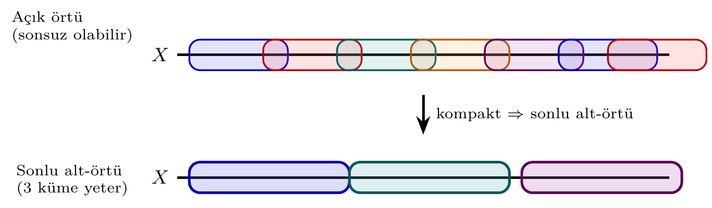
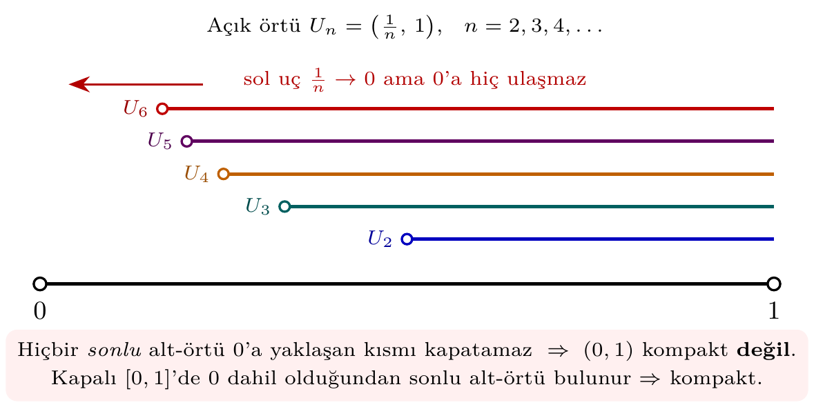
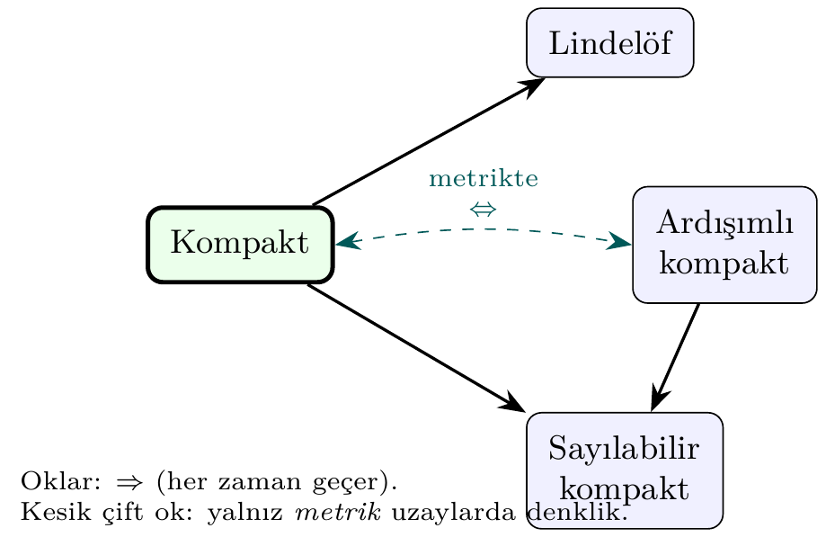

# Bölüm 7 — Kompaktlık

Kompaktlık, sonsuz yapılarda "sınırlılık" fikrinin topolojik soyutlamasıdır.
Açık örtü tanımı temel alınarak incelenmekte; varyantlar ve lokal kompaktlık da ele alınmaktadır.

---

## 1. Konu

### 1.0 Sezgisel Giriş — "Gizli Sonluluk"

Kompaktlığı tek cümlede özetlemek gerekirse: **sonsuz bir uzayın, sonlu bir uzay
gibi davranmasıdır.** Sonlu bir kümede her şey kolaydır — sonlu çoklukta açık
küme, sonlu çoklukta nokta. Kompaktlık, bu "sonluluk konforunu" sonsuz uzaylara
taşıyan köprüdür: uzayı ne kadar çok açık kümeyle örtersek örtelim, **her zaman
sonlu sayıda tanesi yeter.**



Bu "her açık örtüden sonlu alt-örtü çekilebilme" özelliği, analizdeki birçok
teoremin (maksimum değer teoremi, düzgün süreklilik, Heine-Borel) arkasındaki
sessiz kahramandır.

### 1.1 Kompaktlık Tanımı

(X, τ) topolojik uzayı **kompakt** ise:
Her açık örtü `{U_α}` için sonlu alt-örtü vardır.

    X ⊆ ⋃_{α} U_α  ⟹  ∃ sonlu I: X ⊆ ⋃_{α∈I} U_α

> 💡 **Sezgi:** "Açık örtü" = uzayı kaplayan açık küme ailesi. "Sonlu alt-örtü" =
> bu aileden seçilmiş, hâlâ kaplamayı başaran sonlu bir parça. Kompakt = bunu
> *her* örtü için yapabilmek.

#### Neden "kapalı ve sınırlı" yetmez? — Karşı-örnek

Reel doğruda kompaktlık tam olarak "kapalı + sınırlı"ya denk gelir (Heine-Borel).
Ama bu denkliğin neden *sınırlılığa* ve *kapalılığa* aynı anda ihtiyaç duyduğunu
gören en iyi yol açık aralıktır:



> ❌ **Karşı-örnek ((0,1) kompakt değil):** $U_n = \left(\tfrac{1}{n}, 1\right)$
> ailesi $(0,1)$'i örter. Ama sonlu bir alt-aile $\{U_{n_1}, \dots, U_{n_k}\}$
> seçersek, en büyük indis $N=\max n_i$ için birleşim yalnızca $\left(\tfrac{1}{N},
> 1\right)$ olur — $0$'a yakın noktalar açıkta kalır. Sonlu alt-örtü **yok** ⟹
> $(0,1)$ kompakt değil. Oysa kapalı $[0,1]$'de $0$ noktası dahil olduğundan
> sonlu alt-örtü her zaman bulunur.

> ❌ **Karşı-örnek (ℝ kompakt değil):** $V_n = (-n, n)$ ailesi $\mathbb{R}$'yi
> örter ama hiçbir sonlu alt-aile sınırsız $\mathbb{R}$'yi kaplayamaz. Burada
> sorun *sınırsızlık*.

### 1.2 Kompaktlık Varyantları

| Varyant | Tanım |
|---------|-------|
| **Kompakt** | Her açık örtünün sonlu alt-örtüsü var |
| **Sayılabilir kompakt** | Her sayılabilir açık örtünün sonlu alt-örtüsü var |
| **Ardışımlı kompakt** | Her dizi bir yakınsak alt-dizi içerir |
| **Sözde kompakt (pseudocompact)** | Her sürekli f: X → ℝ sınırlıdır |
| **Lindelöf** | Her açık örtünün sayılabilir alt-örtüsü var |
| **σ-kompakt** | Sayılabilir kompakt kümelerin birleşimi |
| **Lokal kompakt** | Her noktanın kompakt komşuluğu var |
| **Metakompakt** | Her açık örtünün nokta-sonlu açık rafinmanı var |



**Her zaman geçen implikasyonlar:** Kompakt ⟹ Sayılabilir kompakt, Kompakt ⟹
Lindelöf, Ardışımlı kompakt ⟹ Sayılabilir kompakt. **Metrik uzaylarda** üç kavram
(kompakt, sayılabilir kompakt, ardışımlı kompakt) çakışır.

### 1.3 Lokal Kompaktlık

x ∈ X noktasında **lokal kompakt:** x'in kompakt kapanış içeren bir komşuluğu
vardır. ℝ kompakt değildir ama lokal kompakttır — bu, tek-nokta
kompaktifikasyonunu (Bölüm 2, Teorem 2.5) mümkün kılan tam özelliktir.

> **Neden bu konu?** Kompaktlık sonlu uzaylarda otomatik doğru; sonsuz uzaylarda ince bir topik — Heine-Borel ve Tychonoff buradan gelir.

> 🔍 **Kendin dene:** `real_line_metric()` ve `closed_unit_interval_metric()` için `is_compact` çıktısını karşılaştırın.

> ⚠️ **Sık hata:** Sonlu uzay her zaman kompakttır; `finite_chain_space` için `is_compact` her zaman `True` döner.

> ↗️ **Bkz.:** Bölüm 6 (kompakt + Hausdorff → normal), Bölüm 10 (kompakt görüntü kompakttır).

> 💭 **Öz-yansıtma:** ℝ kompakt değil ama [0,1] kompakt — fark nerede? (İpucu: yukarıdaki kaçan örtü figürü.)

---

## 2. Teoremler

**Teorem 2.1 (Heine-Borel).** ℝⁿ'de kompakt ⟺ kapalı ve sınırlı.

> **İspat eskizi.** (⟸) [a,b] aralığını ele alalım. Sonlu alt-örtüsü olmayan bir
> açık örtü olduğunu varsayalım. Aralığı ikiye böleriz; en az bir yarısının da
> sonlu alt-örtüsü yoktur. Bunu yineleyerek uzunluğu $0$'a giden iç içe kapalı
> aralıklar dizisi elde ederiz; kesişimleri tek bir $p$ noktasıdır. $p$'yi içeren
> bir örtü elemanı $U$, yeterince küçük aralıkları tümüyle içerir — çelişki.
> ℝⁿ için Tychonoff (Teorem 2.4) ile $[a,b]^n$'e geçilir. (⟹) Kompakt küme
> Hausdorff uzayda kapalıdır; sınırlılık, $\{(-n,n)^n\}$ örtüsünün sonlu
> alt-örtüsünden gelir.

**Teorem 2.2.** Kompakt + Hausdorff ⟹ Normal (T4).

> **İspat eskizi.** $A, B$ ayrık kapalı kümeler olsun (kompakt uzayda kapalı ⟹
> kompakt). Önce bir nokta–kapalı küme ayrımı: sabit $a\in A$ için, Hausdorff'luk
> her $b\in B$'yi $a$'dan açık $U_b \ni a$, $V_b \ni b$ ile ayırır. $\{V_b\}$,
> kompakt $B$'yi örter; sonlu alt-örtü $V_{b_1},\dots,V_{b_k}$ alıp
> $U_a=\bigcap U_{b_i}$, $V_a=\bigcup V_{b_i}$ koyarız: $a$ ile $B$ ayrıştı. Şimdi
> $\{U_a\}_{a\in A}$ kompakt $A$'yı örter; yine sonlu alt-örtüden $A$ ile $B$'yi
> ayıran açık kümeler kurulur.

**Teorem 2.3.** Kompakt uzaydan Hausdorff uzaya sürekli bijeksiyon ⟹ homeomorfizma.

> **İspat eskizi.** $f$'nin kapalı dönüşüm olduğunu göstermek yeter. $C\subseteq X$
> kapalı ⟹ kompakt ⟹ $f(C)$ kompakt (Teorem 2.6) ⟹ Hausdorff hedefte kapalı.
> Demek ki $f^{-1}$ süreklidir.

**Teorem 2.4 (Tychonoff).** Keyfi kompakt uzayların kartezyen çarpımı kompakttır.

**Teorem 2.5 (Alexandroff Tek-Nokta Kompaktifikasyonu).** Her lokal kompakt Hausdorff uzay X için ∞ noktası eklenerek X* = X ∪ {∞} kompakt Hausdorff uzay oluşturulabilir. (Örn. ℝ* ≅ S¹, ℝ²* ≅ S².)

**Teorem 2.6 (Kompakt görüntü).** $f: X \to Y$ sürekli ve $X$ kompakt ise $f(X)$ kompakttır.

> **İspat eskizi.** $\{V_\alpha\}$, $f(X)$'i örten açık aile olsun. Süreklilikten
> $\{f^{-1}(V_\alpha)\}$, $X$'i örten açık ailedir; $X$ kompakt olduğundan sonlu
> alt-örtü $f^{-1}(V_{\alpha_1}),\dots,f^{-1}(V_{\alpha_k})$ vardır. O hâlde
> $V_{\alpha_1},\dots,V_{\alpha_k}$, $f(X)$'i örter. ∎

---

## 3. Algoritmalar

### Sonlu Uzayda Kompaktlık

Sonlu uzay her zaman kompakttır: her örtü sonlu sayıda eleman içerir.
Algoritma: O(1).

### analyze_compactness_variants — Tag Tabanlı Çıkarım

```
AnalyzeVariants(X, τ):
    if X sonlu:
        tüm varyantlar ← True
        return VariantProfile(...)
    tags'e göre çıkarım yap:
        'compact' ∈ tags ⟹ countably_compact, sequentially_compact, lindelof
        'metric' ∧ 'compact' ⟹ sequentially_compact
        'pseudocompact' ∧ ~Tychonoff ⟹ sadece pseudocompact
```

---

## 4. pytop API

```python
from pytop import (
    is_compact,
    is_lindelof,
    is_locally_compact,
    naturals_cofinite,
    one_point_compactification_of_reals,
    one_point_compactification_of_N,
)
from pytop.compactness_variants import (
    is_countably_compact,
    is_sequentially_compact,
    analyze_compactness_variants,
)
```

`analyze_compactness_variants(space)` → `Result` döner; `.value` bir `dict` içerir.
`is_compact(space)` → `.status` alanı `"true"` / `"false"` / `"unknown"` /
`"conditional"` döndürür.

---

## 5. Örnekler

### Örnek 5.1 — Sonlu Uzaylar: Otomatik Kompakt

```python
from pytop import sierpinski_space, discrete_topology, finite_chain_space, is_compact

s = sierpinski_space()
print("Sierpinski compact?", is_compact(s).status)     # true
d = discrete_topology(1, 2, 3)
print("Discrete(3) compact?", is_compact(d).status)    # true
c = finite_chain_space(3)
print("Chain(3) compact?", is_compact(c).status)       # true
```

```text
Sierpinski compact? true
Discrete(3) compact? true
Chain(3) compact? true
```

Sonlu uzaylar trivially kompakttır: her örtü zaten sonlu.

### Örnek 5.2 — Gerçek Doğru ℝ: Kompakt Değil

```python
from pytop import real_line_metric, is_compact, is_lindelof, is_locally_compact

rl = real_line_metric()
print("compact?", is_compact(rl).status)           # false
print("lindelof?", is_lindelof(rl).status)         # true
print("locally_compact?", is_locally_compact(rl).status)  # conditional
```

```text
compact? false
lindelof? true
locally_compact? conditional
```

ℝ kompakt değil (sınırsız), ama Lindelöf ve lokal kompakt.

### Örnek 5.3 — Kapalı [0,1]: Kompakt

```python
from pytop import closed_unit_interval_metric, is_compact
from pytop.compactness_variants import is_sequentially_compact, is_countably_compact

ui = closed_unit_interval_metric()
print("compact?", is_compact(ui).status)                      # true
print("sequentially?", is_sequentially_compact(ui).status)   # true
print("countably?", is_countably_compact(ui).status)         # true
```

```text
compact? true
sequentially? true
countably? true
```

### Örnek 5.4 — Sonsuz Ama Kompakt: Kosonlu Topoloji

Kompaktlık sınırlılığa değil, *örtü davranışına* bağlıdır. Sonsuz bir küme
üzerindeki kosonlu (cofinite) topoloji buna iyi bir örnektir: herhangi bir açık
örtüde tek bir eleman seçtiğimizde, dışarıda yalnızca sonlu çoklukta nokta kalır;
onları da kapatacak sonlu sayıda eleman daha eklenir.

```python
from pytop import naturals_cofinite, is_compact, is_lindelof
from pytop.compactness_variants import is_countably_compact

nc = naturals_cofinite()        # kosonlu topolojili doğal sayılar
print("compact?", is_compact(nc).status)               # true
print("lindelof?", is_lindelof(nc).status)             # true
print("countably?", is_countably_compact(nc).status)   # true
```

```text
compact? true
lindelof? true
countably? true
```

Sonsuz olmasına karşın kompakt — "kompakt = sonlu" sezgisinin neden yalnızca
*metrik* uzaylarda işlediğini gösterir.

### Örnek 5.5 — Tek-Nokta Kompaktifikasyon (Alexandroff)

Lokal kompakt ama kompakt olmayan bir uzaya tek bir "∞" noktası ekleyerek onu
kompakt hâle getirebiliriz (Teorem 2.5). ℝ için sonuç çembere (S¹), ℕ için ise
yakınsak bir diziye denktir.

```python
from pytop import (
    one_point_compactification_of_reals,
    one_point_compactification_of_N,
    is_compact,
)

r_star = one_point_compactification_of_reals()   # R ∪ {∞} ≅ S¹
n_star = one_point_compactification_of_N()        # N ∪ {∞}, yakınsak dizi
print("R* compact?", is_compact(r_star).status)   # true
print("N* compact?", is_compact(n_star).status)   # true
```

```text
R* compact? true
N* compact? true
```

ℝ kompakt değildi (Örnek 5.2); tek bir nokta eklemek onu kompakt yaptı.

### Örnek 5.6 — analyze_compactness_variants: Gerçek Doğru

```python
from pytop import real_line_metric
from pytop.compactness_variants import analyze_compactness_variants

rl = real_line_metric()
r = analyze_compactness_variants(rl)
for key, val in r.value.items():
    if hasattr(val, 'status'):
        print(f"  {key:<25}: {val.status}")
    else:
        print(f"  {key:<25}: {val}")
```

```text
  representation           : infinite_metric
  countably_compact        : unknown
  sequentially_compact     : unknown
  pseudocompact            : false
  feebly_compact           : false
  metacompact              : true
  relatively_compact       : unknown
  sigma_compact            : unknown
  lindelof                 : true
```

### Örnek 5.7 — analyze_compactness_variants: Sierpiński

```python
from pytop import sierpinski_space
from pytop.compactness_variants import analyze_compactness_variants

s = sierpinski_space()
r = analyze_compactness_variants(s)
for key, val in r.value.items():
    if hasattr(val, 'status'):
        print(f"  {key:<25}: {val.status}")
    else:
        print(f"  {key:<25}: {val}")
```

```text
  representation           : finite
  countably_compact        : true
  sequentially_compact     : true
  pseudocompact            : true
  feebly_compact           : true
  metacompact              : true
  relatively_compact       : true
  sigma_compact            : true
  lindelof                 : true
```

---

## 6. Alıştırmalar

### Kodlama

K1. `finite_chain_space(5)` ve `discrete_topology(1,2,3,4,5)` için `is_compact` karşılaştırın.
    Her ikisi de kompakt mı?

K2. `naturals_cofinite()` için `is_compact`, `is_lindelof`, `is_countably_compact` hesaplayın.

K3. `closed_unit_interval_metric()` ile `real_line_metric()` için
    `analyze_compactness_variants` çalıştırıp çıktıları karşılaştırın.

K4. `real_line_metric()` kompakt değildi. `one_point_compactification_of_reals()`
    çıktısının `is_compact` durumunu kontrol edip tek noktanın kompaktlığı nasıl
    kurtardığını açıklayın.

### Teori

T1. Kompakt + sürekli ⟹ görüntü kompakt olduğunu ispatlayın.
    (İpucu: görüntüdeki bir açık örtüyü geri çek — Teorem 2.6 eskizi.)

T2. Heine-Borel teoreminin ℝ'deki neden geçerli olduğunu açıklayın:
    [0,1] neden kompakt, (0,1) neden kompakt değil?
    (İpucu: §1.1'deki kaçan örtü $U_n=(1/n,1)$.)

T3. Kompakt + Hausdorff ⟹ Normal (Teorem 2.2) ispatında, $B$'yi örten
    $\{V_b\}$ ailesinden sonlu alt-örtü çekme adımının neden kompaktlığa
    ihtiyaç duyduğunu açıklayın.
