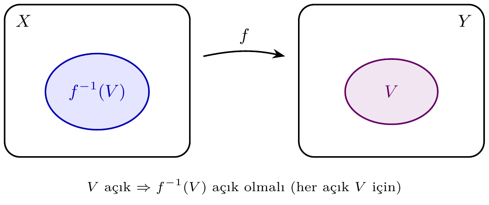
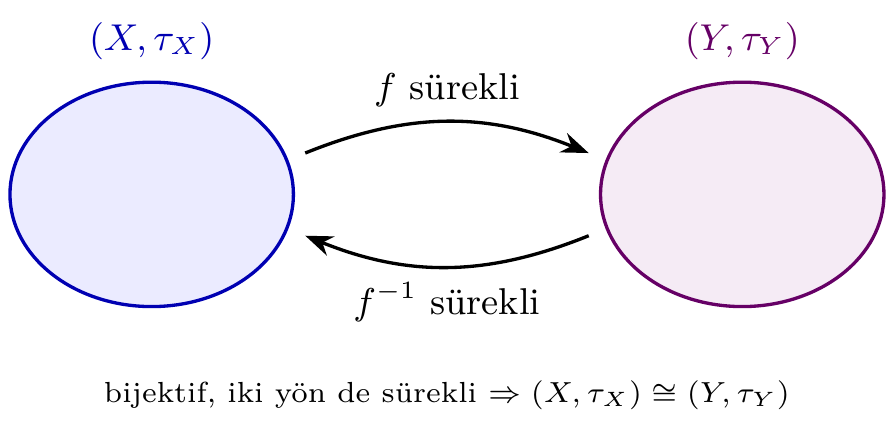
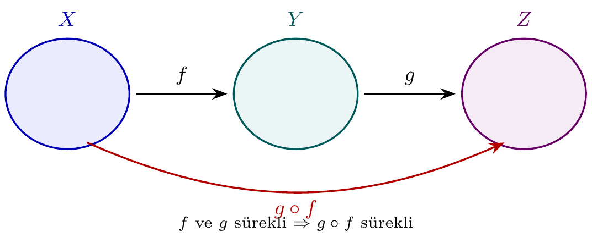

# Bölüm 10 — Sürekli Fonksiyonlar ve Homeomorfizmalar

Topolojik uzaylar arasındaki fonksiyonlarda süreklilik, açık kümelerin
geri çekiminin (preimage) açık olması koşuluna dayanır. Homeomorfizma ise
topolojik yapıyı tam olarak koruyan bijektif sürekli fonksiyondur.

---

## 1. Konu

> **💡 Sezgi:** Sürekliliği "açıklığın geri taşınması" gibi düşünün: hedef uzayda hangi açık kümeye bakarsanız bakın, onun *geri çekimi* (preimage) kaynak uzayda yine açık olmalı. Analizden bildiğiniz "ε–δ" tanımı bunun metrik özelidir; topolojide ε–δ yerine doğrudan açık kümelerin dilini kullanırız. Homeomorfizma ise bu taşımanın *iki yönde* de bozulmadan işlemesi — yani iki uzayın topolojik olarak "aynı" olmasıdır.

### Süreklilik Tanımı

f: (X, τ_X) → (Y, τ_Y) fonksiyonu **sürekli** ise:

    ∀ V ∈ τ_Y: f⁻¹(V) ∈ τ_X



Eşdeğer koşullar:
- Her kapalı F ⊆ Y için f⁻¹(F) kapalıdır.
- Her x ∈ X ve f(x)'in her komşuluğu W için f⁻¹(W), x'in komşuluğudur.

### Süreklilik Hiyerarşisi

| Tür | Koşul |
|-----|-------|
| **Sabit fonksiyon** | f(x) = c; her zaman sürekli |
| **Özdeşlik** | f(x) = x; her zaman sürekli |
| **Bileşke** | f, g sürekli ⟹ g∘f sürekli |
| **Homeomorfizma** | Bijektif, f ve f⁻¹ sürekli |



### Görüntü ve Geri Çekim

- **Görüntü:** f(A) = {f(x) : x ∈ A}
- **Geri çekim:** f⁻¹(B) = {x ∈ X : f(x) ∈ B}

> **🚫 Karşı-örnek:** Süreklilik *yöne duyarlıdır*. Aynı taşıyıcı küme `{0,1}` üzerinde özdeşlik fonksiyonunu düşünün: ayrık topolojiden (ince) Sierpiński'ye (kaba) **sürekli**, ama Sierpiński'den ayrığa **sürekli değil** — çünkü ayrıktaki açık `{0}`'ın geri çekimi Sierpiński'de açık değildir. Yani "kaba → ince" yönünde özdeşlik genelde süreklilik kaybeder. (Örnek 5.8'de doğrulanır.)

> **Neden bu konu?** Süreklilik topolojinin temel kavramı; homeomorfizma yapı-koruma denkliğidir.

> 🔍 **Kendin dene:** Sierpiński → Sierpiński'ye kaç fonksiyon var, kaçı sürekli? `is_continuous_finite_map` ile tek tek test edin.

> ⚠️ **Sık hata:** `s_topo = list(s.topology)` kullanın; `[set(u) for u in s.topology]` gerekmez — `is_continuous_finite_map` `Iterable[Iterable]` kabul eder.

> ↗️ **Bkz.:** Bölüm 7 (kompakt görüntü kompakt), Bölüm 8 (bağlantılı görüntü bağlantılı).

> 💭 **Öz-yansıtma:** Homeomorfizma ile izomorfizma arasındaki fark ne? Hangi yapıyı korur?

---

## 2. Teoremler

**Teorem 2.1.** Her sabit fonksiyon süreklidir.
*(Kanıt: f⁻¹(V) = X eğer c ∈ V, ∅ eğer c ∉ V; her ikisi de açık.)*

**Teorem 2.2.** f: X → Y ve g: Y → Z sürekli ⟹ g∘f sürekli.

> **İspat eskizi.** W ⊆ Z açık olsun. g sürekli olduğundan g⁻¹(W) ⊆ Y açıktır. f sürekli olduğundan f⁻¹(g⁻¹(W)) ⊆ X açıktır. Ama (g∘f)⁻¹(W) = f⁻¹(g⁻¹(W)) olduğundan g∘f'in her açık kümenin geri çekimi açıktır — yani g∘f süreklidir.



**Teorem 2.3.** f: X → Y sürekli, X kompakt ⟹ f(X) kompakttır.

> **İspat eskizi.** f(X)'in bir açık örtüsü `{V_α}` verilsin (Y'nin açıklarıyla). f sürekli olduğundan her f⁻¹(V_α) X'te açıktır ve bunlar X'i örter. X kompakt olduğundan sonlu bir alt-örtü f⁻¹(V_{α₁}), …, f⁻¹(V_{αₙ}) vardır. O zaman V_{α₁}, …, V_{αₙ} f(X)'i örter: süreklilik açık örtüyü geri çeker, kompaktlık sonlu alt-örtü verir, görüntüye geri itilir. Demek ki f(X) kompakttır.

**Teorem 2.4.** f: X → Y sürekli, X bağlantılı ⟹ f(X) bağlantılıdır.

**Teorem 2.5.** f: X → Y homeomorfizma ⟺ bijektif, f sürekli, f⁻¹ sürekli.

**Teorem 2.6.** Kompakt X'ten Hausdorff Y'ye sürekli bijeksiyon ⟹ homeomorfizma.

---

## 3. Algoritmalar

### is_continuous_finite_map — O(|τ_Y| · |X|)

```
IsContinuous(X, tau_X, Y, tau_Y, f):
    for each V in tau_Y:
        preimage <- {x in X : f(x) in V}
        if preimage not in tau_X: return False
    return True
```

Her açık küme için geri çekim hesaplanır.

---

## 4. pytop API

```python
from pytop import (
    is_continuous_finite_map,
    finite_homeomorphism_result,
    sierpinski_space,
    discrete_topology,
    indiscrete_topology,
    make_set,
    empty_set,
)
```

`is_continuous_finite_map(domain, domain_topology, codomain, codomain_topology, mapping)` → `bool`

`finite_homeomorphism_result(left, right)` → `Result` (.status: 'true'/'false')

---

## 5. Örnekler

### Örnek 5.1 — Sabit Fonksiyon: Her Zaman Sürekli

```python
s = sierpinski_space()
s_pts = list(s.carrier)
s_topo = list(s.topology)

f_const = {0: 1, 1: 1}
result = is_continuous_finite_map(s_pts, s_topo, s_pts, s_topo, f_const)
print("continuous:", result)
```

```text
continuous: True
```

### Örnek 5.2 — Ayrık Topoloji: Her Fonksiyon Sürekli

```python
d = discrete_topology(0, 1)
d_pts = list(d.carrier)
d_topo = list(d.topology)

f_id   = {0: 0, 1: 1}
f_swap = {0: 1, 1: 0}
print("ozdeslik continuous:", is_continuous_finite_map(d_pts, d_topo, d_pts, d_topo, f_id))
print("swap     continuous:", is_continuous_finite_map(d_pts, d_topo, d_pts, d_topo, f_swap))
```

```text
ozdeslik continuous: True
swap     continuous: True
```

Ayrık topolojide her fonksiyon süreklidir: geri çekim her zaman açıktır.

### Örnek 5.3 — Sierpiński → Ayrık: Sürekli Değil

```python
print("id: Sierpinski -> Disc:", is_continuous_finite_map(s_pts, s_topo, d_pts, d_topo, f_id))
print("id: Disc -> Sierpinski:", is_continuous_finite_map(d_pts, d_topo, s_pts, s_topo, f_id))
```

```text
id: Sierpinski -> Disc continuous: False
id: Disc -> Sierpinski continuous: True
```

Sierpiński τ = {∅, {0,1}, {1}}: id: S→D'de f⁻¹({0}) = {0} — Sierpiński'de açık değil.

### Örnek 5.4 — İndiscrete'ten Süreklilik

```python
ind = indiscrete_topology(0, 1)
ind_pts = list(ind.carrier)
ind_topo = list(ind.topology)

f_const0 = {0: 0, 1: 0}
print("id (0->0,1->1)    continuous:", is_continuous_finite_map(ind_pts, ind_topo, s_pts, s_topo, f_id))
print("const_0 (tum->0)  continuous:", is_continuous_finite_map(ind_pts, ind_topo, s_pts, s_topo, f_const0))
```

```text
id (0->0, 1->1) continuous: False
const_0 (tum->0) continuous: True
```

İndiscrete'den süreklilik: f⁻¹(V) ∈ {∅, X} olmalı. Sabit fonksiyon sağlar, özdeşlik sağlamaz.

### Örnek 5.5 — Homeomorfizma Kontrolü

```python
d2a = discrete_topology(1, 2)
d2b = discrete_topology('a', 'b')
ind2 = indiscrete_topology(1, 2)

print("D(1,2) ~ D(a,b):", finite_homeomorphism_result(d2a, d2b).status)
print("D(1,2) ~ S(0,1):", finite_homeomorphism_result(d2a, s).status)
print("D(1,2) ~ Ind(1,2):", finite_homeomorphism_result(d2a, ind2).status)
```

```text
D(1,2) ~ D(a,b): true
D(1,2) ~ S(0,1): false
D(1,2) ~ Ind(1,2): false
```

### Örnek 5.6 — Özel Topolojili Süreklilik

```python
X = [1, 2, 3]
tau_X = [empty_set(), make_set(1), make_set(2, 3), make_set(1, 2, 3)]
f_23swap = {1: 1, 2: 3, 3: 2}
print("2-3 swap surekli mi:", is_continuous_finite_map(X, tau_X, X, tau_X, f_23swap))
```

```text
2-3 swap surekli mi: True
```

### Örnek 5.7 — Bileşke Süreklilik: g∘f

Üç zincir topolojisi `{∅, {α}, {α,β}, X}` üzerinde zinciri koruyan iki sürekli
fonksiyonun bileşkesi de süreklidir (Teorem 2.2'nin sayısal doğrulaması).

```python
TX = make_topology(make_set(1, 2, 3), make_set(1), make_set(1, 2))
TY = make_topology(make_set('a', 'b', 'c'), make_set('a'), make_set('a', 'b'))
TZ = make_topology(make_set('p', 'q', 'r'), make_set('p'), make_set('p', 'q'))
X_pts, X_topo = list(TX.carrier), list(TX.topology)
Y_pts, Y_topo = list(TY.carrier), list(TY.topology)
Z_pts, Z_topo = list(TZ.carrier), list(TZ.topology)

f = {1: 'a', 2: 'b', 3: 'c'}
g = {'a': 'p', 'b': 'q', 'c': 'r'}
gof = {x: g[f[x]] for x in X_pts}

print("f continuous:    ", is_continuous_finite_map(X_pts, X_topo, Y_pts, Y_topo, f))
print("g continuous:    ", is_continuous_finite_map(Y_pts, Y_topo, Z_pts, Z_topo, g))
print("g of f continuous:", is_continuous_finite_map(X_pts, X_topo, Z_pts, Z_topo, gof))
```

```text
f continuous:     True
g continuous:     True
g of f continuous: True
```

İki sürekli fonksiyonun geri çekimleri zincirlendiğinde açıklık korunur:
(g∘f)⁻¹(W) = f⁻¹(g⁻¹(W)).

### Örnek 5.8 — Süreklilik Yöne Duyarlı: İnce → Kaba Sürekli, Kaba → İnce Değil

Aynı `{0,1}` taşıyıcısında özdeşlik fonksiyonu, ayrık (ince) topolojiden
Sierpiński'ye (kaba) süreklidir; ters yön sürekli değildir.

```python
fine = discrete_topology(0, 1)
coarse = sierpinski_space()
fine_pts, fine_topo = list(fine.carrier), list(fine.topology)
co_pts, co_topo = list(coarse.carrier), list(coarse.topology)
idmap = {0: 0, 1: 1}

print("id: discrete -> sierpinski:", is_continuous_finite_map(fine_pts, fine_topo, co_pts, co_topo, idmap))
print("id: sierpinski -> discrete:", is_continuous_finite_map(co_pts, co_topo, fine_pts, fine_topo, idmap))
```

```text
id: discrete -> sierpinski: True
id: sierpinski -> discrete: False
```

Ayrıktaki açık `{0}`'ın geri çekimi yine `{0}`'dır; bu Sierpiński τ = {∅, {1}, {0,1}}
içinde açık olmadığından "kaba → ince" yönü süreklilik kaybeder.

---

## 6. Alıştırmalar

### Kodlama

K1. `make_topology([0,1,2], set(), {0}, {0,1}, {0,1,2})` topolojisinde
    f(0)=0, f(1)=0, f(2)=1 fonksiyonunun sürekli olup olmadığını kontrol edin.

K2. Sierpiński uzayından kendisine giden dört fonksiyonu (sabit 0, sabit 1,
    özdeşlik, swap) test edin: hangileri sürekli?

K3. `finite_homeomorphism_result` ile {1,2,3} ayrık ve {a,b,c} ayrık
    topolojilerinin homeomorf olduğunu doğrulayın.

K4. `make_topology` ile {1,2,3} üzerinde `{α}`, `{α,β}` açıklarıyla iki zincir
    topolojisi kurun; zinciri koruyan `f` ve `g` tanımlayıp `f`, `g` ve `g∘f`
    fonksiyonlarının üçünün de sürekli olduğunu `is_continuous_finite_map`
    ile doğrulayın (Teorem 2.2'nin sayısal kontrolü).

### Teori

T1. Her sabit fonksiyonun sürekli olduğunu ispatlayın.

T2. f: X → Y ve g: Y → Z sürekli ⟹ g∘f sürekli olduğunu ispatlayın.

T3. f: X → Y sürekli ve X kompakt ise f(X)'in kompakt olduğunu ispatlayın.
    (İpucu: f(X)'in bir açık örtüsünü f ile geri çekin, X'in kompaktlığını
    kullanın, sonlu alt-örtüyü görüntüye geri itin.)
