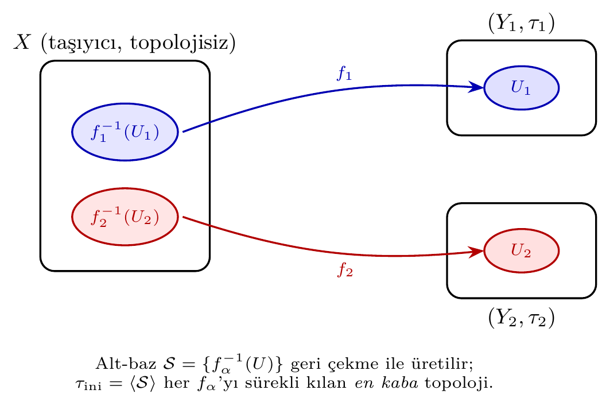
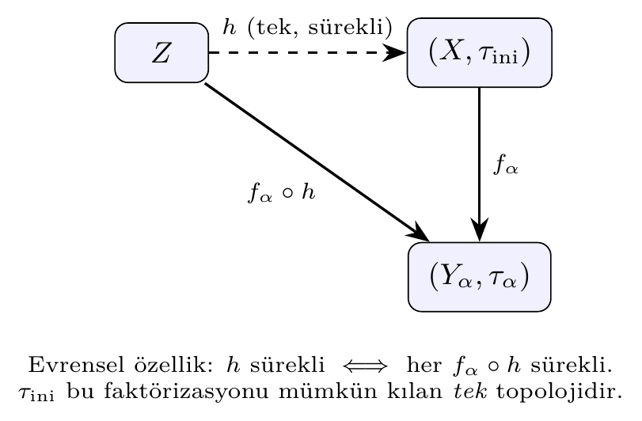
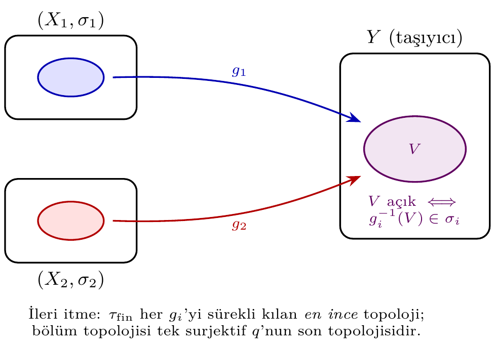

# Bölüm 13 — Başlangıç ve Son Topoloji

**Başlangıç topolojisi** (initial topology): verilen haritaları sürekli kılan en kaba
(coarsest) topolojidir.
**Son topoloji** (final topology): verilen haritaları sürekli kılan en ince (finest)
topolojidir.
Altuzay ve çarpım topolojileri başlangıç topolojisinin; bölüm topolojisi ise son
topolojisinin özel halleridir.

> 💡 **Sezgi:** Başlangıç topolojisini, $X$'e "tam yeterince" açık küme koyan bir
> ayar düğmesi gibi düşünün. Çok az açık koyarsanız $f_\alpha$ haritaları sürekli
> olmaz; çok fazla koyarsanız gereksizdir. Geri çekme $f_\alpha^{-1}(U)$ ile üretilen
> alt-baz, haritaları sürekli kılan en küçük (en kaba) açık-küme koleksiyonudur. Son
> topoloji ise tam tersi yönde çalışır: $Y$'ye "en çok" açık kümeyi koyar, ama her
> $g_i$'yi sürekli bozmadan.



---

## 1. Başlangıç Topolojisi

$X$ kümesi ve haritalar ailesi $\{f_\alpha : X \to (Y_\alpha, \tau_\alpha)\}_{\alpha \in A}$
verilsin.

**Tanım.** **Başlangıç topolojisi** $\tau_{\mathrm{ini}}$, her $f_\alpha$'yı sürekli kılan
topolojilerin kesişimidir. Alt-baz:

$$\mathcal{S} = \{f_\alpha^{-1}(U) \mid U \in \tau_\alpha,\ \alpha \in A\}$$

$\tau_{\mathrm{ini}} = \langle \mathcal{S} \rangle$ bu alt-bazın ürettiği (kesişim ve
birleşim kapatmasıyla elde edilen) topolojidir.

**Teorem 1.** $\tau_{\mathrm{ini}}$ tekil ve vardır; her $f_\alpha$'yı sürekli kılan
tüm topolojilerin en kaba olanıdır.

> **İspat eskizi.** $\langle\mathcal{S}\rangle$ topolojisi her $f_\alpha$'yı sürekli
> kılar: her $U \in \tau_\alpha$ için $f_\alpha^{-1}(U) \in \mathcal{S} \subseteq
> \langle\mathcal{S}\rangle$ açıktır. Şimdi $\tau'$ de her $f_\alpha$'yı sürekli kılsın.
> O zaman süreklilik tanımından $f_\alpha^{-1}(U) \in \tau'$, yani
> $\mathcal{S} \subseteq \tau'$. Bir topoloji alt-bazını içerdiğinde onun ürettiği
> topolojiyi de içerir, dolayısıyla $\langle\mathcal{S}\rangle \subseteq \tau'$.
> Demek ki $\tau_{\mathrm{ini}}=\langle\mathcal{S}\rangle$ tüm uygun topolojilerin
> en kabasıdır; teklik bu minimallikten gelir. $\square$

**Teorem 2.** Altuzay topolojisi = ekleme haritası $i: A \hookrightarrow X$'in başlangıç
topolojisidir.

**Teorem 3.** Çarpım topolojisi = projeksiyon haritaları $\{\pi_\alpha\}$'nın başlangıç
topolojisidir.

**Teorem 4 (evrensel özellik).** $h: Z \to (X, \tau_{\mathrm{ini}})$ süreklidir ancak
ve ancak $f_\alpha \circ h$ her $\alpha$ için sürekli olduğunda.

> **İspat eskizi.** ($\Rightarrow$) $h$ sürekli ve $f_\alpha$ sürekli ise bileşke
> $f_\alpha \circ h$ süreklidir (sürekli haritaların bileşkesi). ($\Leftarrow$) Her
> $f_\alpha \circ h$ sürekli olsun. $\tau_{\mathrm{ini}}$'nin bir alt-baz elemanı
> $f_\alpha^{-1}(U)$ biçimindedir; ön-görüntüsü
> $h^{-1}(f_\alpha^{-1}(U)) = (f_\alpha \circ h)^{-1}(U)$, ki bu $f_\alpha \circ h$
> sürekli olduğundan $Z$'de açıktır. Alt-baz elemanlarının ön-görüntüleri açık olunca
> $h$ süreklidir (süreklilik alt-bazda denetlenebilir). $\square$



> **Neden bu konu?** İlk topoloji (en kaba), son topoloji (en ince) — süreklilik koşulunu minimize eden ve maksimize eden ekstremler.

> 🔍 **Kendin dene:** `initial_topology` ile `final_topology`'nin boyutunu karşılaştırın; hangisi daha büyük?

> ⚠️ **Sık hata:** İlk topoloji çekime göre en küçük, son topoloji itmeye göre en büyük topolojidir; karıştırmayın.

> ↗️ **Bkz.:** Bölüm 10 (süreklilik), Bölüm 11 (çarpım = fonksiyon ailesine göre ilk).

> 💭 **Öz-yansıtma:** Çarpım topolojisi neden ilk topolojiye özel bir örnektir?

---

## 2. pytop API: `initial_topology_from_maps`

İmza (örnek olarak çalıştırılmaz, yalnızca biçim gösterimi):

```text
initial_topology_from_maps(carrier, [FiniteMap(domain, codomain, name, mapping)])
```

Her `FiniteMap`, kodomen uzayındaki açık kümelerin ön-görüntülerini alt-baza ekler.
`FiniteMap` doğrudan veri sınıfı olarak kullanılır; `make_function` değil.

**Algoritma:**
1. Her $f_\alpha$ için $\{f_\alpha^{-1}(U) \mid U \in \tau_\alpha\}$ ön-görüntülerini
   hesapla — $O(|\tau_\alpha| \cdot |X|)$.
2. Ön-görüntülerin birleşiminden alt-baz $\mathcal{S}$ oluştur.
3. Alt-bazdan topolojiyi üret (Bölüm 4'teki baz–topoloji inşası) —
   $O(|\mathcal{S}| \cdot 2^{|X|})$ en kötü.

---

## 3. Tek Harita ile Başlangıç Topolojisi

```python
from pytop.finite_map_analysis import FiniteMap
from pytop import (
    initial_topology_from_maps,
    generic_quotient_space_from_map,
    discrete_topology,
    indiscrete_topology,
    make_topology,
    sierpinski_space,
    finite_subspace,
    binary_product,
    is_continuous_finite_map,
    is_t0,
    is_t2,
)

X_carrier = [0, 1, 2, 3]
Y_d = discrete_topology(0, 1)
X_ph = make_topology(X_carrier, set(), set(X_carrier))

f = FiniteMap(domain=X_ph, codomain=Y_d, name="f",
              mapping={0: 0, 1: 0, 2: 1, 3: 1})

tau_f = initial_topology_from_maps(X_carrier, [f])

print("f: {0,1} -> 0, {2,3} -> 1")
print("Baslangic topolojisi:")
for u in sorted([sorted(u) for u in tau_f.topology], key=lambda x: (len(x), x)):
    print("  ", u if u else "empty")
print("Eleman sayisi:", len(tau_f.topology))
```

```text
f: {0,1} -> 0, {2,3} -> 1
Baslangic topolojisi:
   empty
   [0, 1]
   [2, 3]
   [0, 1, 2, 3]
Eleman sayisi: 4
```

Alt-baz hesabı: $f^{-1}(\emptyset)=\emptyset$, $f^{-1}(\{0\})=\{0,1\}$,
$f^{-1}(\{1\})=\{2,3\}$, $f^{-1}(\{0,1\})=\{0,1,2,3\}$.

---

## 4. İkinci Harita Topolojiyi İnceltir

```python
from pytop import sierpinski_space

S_sier = sierpinski_space()   # carrier {0,1}, açık kümeler: ∅, {1}, {0,1}
g = FiniteMap(domain=X_ph, codomain=S_sier, name="g",
              mapping={0: 0, 1: 1, 2: 1, 3: 1})

tau_fg = initial_topology_from_maps(X_carrier, [f, g])

print("g: {0} -> 0, {1,2,3} -> 1  (Sierpinski kodomen)")
print("Baslangic topolojisi (f ve g birlikte):")
for u in sorted([sorted(u) for u in tau_fg.topology], key=lambda x: (len(x), x)):
    print("  ", u if u else "empty")
print("f tek basina:", len(tau_f.topology), "eleman  |  f+g:", len(tau_fg.topology), "eleman")
```

```text
g: {0} -> 0, {1,2,3} -> 1  (Sierpinski kodomen)
Baslangic topolojisi (f ve g birlikte):
   empty
   [1]
   [0, 1]
   [2, 3]
   [1, 2, 3]
   [0, 1, 2, 3]
f tek basina: 4 eleman  |  f+g: 6 eleman
```

$g$'nin katkısı: $g^{-1}(\{1\}) = \{1,2,3\}$. Yeni kesişim:
$\{0,1\} \cap \{1,2,3\} = \{1\}$. Daha fazla harita → daha ince veya eşit topoloji.

---

## 5. Özel Hal 1 — Altuzay = Başlangıç Topolojisi

```python
from pytop import finite_subspace

fts_X = make_topology([0, 1, 2, 3], set(), {0, 1}, {2, 3}, {0, 1, 2, 3})

sub_A  = finite_subspace(fts_X, [1, 2])

A_dom  = discrete_topology(1, 2)
inc    = FiniteMap(domain=A_dom, codomain=fts_X, name="i", mapping={1: 1, 2: 2})
init_A = initial_topology_from_maps([1, 2], [inc])

sub_tau  = sorted([sorted(u) for u in sub_A.topology],  key=lambda x: (len(x), x))
init_tau = sorted([sorted(u) for u in init_A.topology], key=lambda x: (len(x), x))

print("X topolojisi:", sorted([sorted(u) for u in fts_X.topology], key=lambda x: (len(x), x)))
print("A={1,2} altuzay topolojisi :", sub_tau)
print("A={1,2} baslangic topolojisi:", init_tau)
print("Esit mi:", sub_tau == init_tau)
```

```text
X topolojisi: [[], [0, 1], [2, 3], [0, 1, 2, 3]]
A={1,2} altuzay topolojisi : [[], [1], [2], [1, 2]]
A={1,2} baslangic topolojisi: [[], [1], [2], [1, 2]]
Esit mi: True
```

$i^{-1}(\{0,1\})=\{1\}$, $i^{-1}(\{2,3\})=\{2\}$ → alt-baz $\{\{1\},\{2\}\}$ →
$\tau_{\mathrm{ini}} = \{\emptyset,\{1\},\{2\},\{1,2\}\}$ = discrete$(\{1,2\})$.

---

## 6. Özel Hal 2 — Çarpım = Başlangıç Topolojisi

```python
from pytop import binary_product

d2   = discrete_topology(0, 1)
prod = binary_product(d2, d2)

pi_x = FiniteMap(domain=prod, codomain=d2, name="pi_x",
                 mapping={(0,0):0, (0,1):0, (1,0):1, (1,1):1})
pi_y = FiniteMap(domain=prod, codomain=d2, name="pi_y",
                 mapping={(0,0):0, (0,1):1, (1,0):0, (1,1):1})

init_prod = initial_topology_from_maps(list(prod.carrier), [pi_x, pi_y])

prod_fs = {frozenset(u) for u in prod.topology}
init_fs = {frozenset(u) for u in init_prod.topology}

print("Carpim topolojisi eleman sayisi  :", len(prod.topology))
print("Baslangic topolojisi eleman sayisi:", len(init_prod.topology))
print("Esit mi:", prod_fs == init_fs)
```

```text
Carpim topolojisi eleman sayisi  : 16
Baslangic topolojisi eleman sayisi: 16
Esit mi: True
```

$\pi_x^{-1}(\{0\})=\{(0,0),(0,1)\}$, $\pi_y^{-1}(\{0\})=\{(0,0),(1,0)\}$; kesişimleri
tüm tektonları üretir → discrete$(\{0,1\}^2)$ = 16 açık küme.

---

## 7. Son Topoloji

Haritalar ailesi $\{g_i : (X_i, \sigma_i) \to Y\}$ verilsin.

**Tanım.** **Son topoloji** $\tau_{\mathrm{fin}}$, $Y$ üzerinde her $g_i$'yi sürekli
kılan en ince topolojidir:

$$V \in \tau_{\mathrm{fin}} \iff g_i^{-1}(V) \in \sigma_i \quad (\forall i)$$

**Teorem 5.** $\tau_{\mathrm{fin}}$ tekil ve vardır; en ince (finest) topolojidir.

**Teorem 6 (evrensel özellik).** $h: (Y, \tau_{\mathrm{fin}}) \to Z$ süreklidir ancak
ve ancak $h \circ g_i$ her $i$ için sürekli olduğunda.

**Teorem 7.** Bölüm topolojisi, tek surjektif haritanın $q: X \to X/{\sim}$ son
topolojisidir.

**Algoritma (sonlu durum).** $Y$'nin tüm alt kümelerini tara; $g_i^{-1}(V) \in \sigma_i$
her $i$ için sağlanıyorsa $V$ açık — $O(2^{|Y|} \cdot \sum |\sigma_i|)$.

---

## 8. Son Topoloji — Manuel Hesap

```python
X1     = make_topology([0, 1, 2], set(), {0, 1}, {0, 1, 2})
Y_car  = [0, 1]
g1_map = {0: 0, 1: 0, 2: 1}
tau_X1 = {frozenset(u) for u in X1.topology}

open_Y = []
for mask in range(1 << len(Y_car)):
    V        = frozenset(Y_car[i] for i in range(len(Y_car)) if mask & (1 << i))
    preimage = frozenset(x for x in X1.carrier if g1_map[x] in V)
    if preimage in tau_X1:
        open_Y.append(set(V))

final_Y   = make_topology(Y_car, *open_Y)
final_tau = sorted([sorted(u) for u in final_Y.topology], key=lambda x: (len(x), x))

print("X1 topolojisi:", sorted([sorted(u) for u in X1.topology], key=lambda x: (len(x), x)))
print("g1: {0,1} -> 0, {2} -> 1")
print("Son topoloji on Y={0,1}:", final_tau)
```

```text
X1 topolojisi: [[], [0, 1], [0, 1, 2]]
g1: {0,1} -> 0, {2} -> 1
Son topoloji on Y={0,1}: [[], [0], [0, 1]]
```

$V=\{0\}$: $g_1^{-1}(\{0\})=\{0,1\} \in \tau_{X_1}$ ✓ —
$V=\{1\}$: $g_1^{-1}(\{1\})=\{2\} \notin \tau_{X_1}$ ✗.
Son topoloji $= \{\emptyset, \{0\}, \{0,1\}\}$ — Sierpiński benzeri, 3 eleman.

---

## 9. Bölüm Topolojisi = Son Topoloji

```python
from pytop import generic_quotient_space_from_map

Y_ind  = indiscrete_topology(0, 1)
q      = FiniteMap(domain=X1, codomain=Y_ind, name="q",
                   mapping={0: 0, 1: 0, 2: 1})

quot_Y   = generic_quotient_space_from_map(q)
quot_tau = sorted([sorted(u) for u in quot_Y.topology], key=lambda x: (len(x), x))

print("generic_quotient_space_from_map sonucu:", quot_tau)
print("Manuel son topoloji ile esit mi  :", quot_tau == final_tau)
print("Son topoloji T0 mi:", is_t0(final_Y).status)
print("Son topoloji T2 mi:", is_t2(final_Y).status)
```

```text
generic_quotient_space_from_map sonucu: [[], [0], [0, 1]]
Manuel son topoloji ile esit mi  : True
Son topoloji T0 mi: true
Son topoloji T2 mi: false
```

`generic_quotient_space_from_map`, haritanın kodomenini görmezden gelerek
$q^{-1}(V) \in \tau_{X_1}$ koşuluyla doğrudan son topolojiyi inşa eder.

---



## 10. Yeni Örnek — "En Kaba" Olmanın Doğrudan Doğrulanması

Başlangıç topolojisinin tanımı *en kaba* olmaktır: $f$'yi sürekli kılar, ama ondan
daha kaba hiçbir topoloji kılamaz. Bunu süreklilik yüklemiyle birebir doğrulayalım.
`is_continuous_finite_map(domain, domain_topology, codomain, codomain_topology, mapping)`
ham taşıyıcı + açık-küme listeleri alıp `bool` döndürür.

```python
ini      = [set(u) for u in tau_f.topology]
codom    = [set(u) for u in Y_d.topology]
coarser  = [set(), set(X_carrier)]   # indiscrete: tau_ini'den kesinlikle daha kaba

print("f, tau_ini'ye gore surekli mi:",
      is_continuous_finite_map(X_carrier, ini, list(Y_d.carrier), codom, f.mapping))
print("f, daha kaba (indiscrete) topolojiye gore surekli mi:",
      is_continuous_finite_map(X_carrier, coarser, list(Y_d.carrier), codom, f.mapping))
print("tau_ini eleman sayisi:", len(tau_f.topology))
```

```text
f, tau_ini'ye gore surekli mi: True
f, daha kaba (indiscrete) topolojiye gore surekli mi: False
tau_ini eleman sayisi: 4
```

$\tau_{\mathrm{ini}}$ ile $f$ sürekli; aynı $f$ kaba indiscrete topolojiyle sürekli
**değil** — çünkü $f^{-1}(\{0\})=\{0,1\}$ indiscrete topolojide açık değildir.
$\tau_{\mathrm{ini}}$ tam da bu açık kümeyi ekleyecek kadar incedir, fazlası değil:
*en kaba* sıfatının somut kanıtı budur.

> ❌ **Karşı-örnek:** "Daha çok açık küme her zaman daha iyidir" sanmayın. Discrete
> topoloji de $f$'yi sürekli kılar (16 açık küme), ama o *en kaba* değildir — başlangıç
> topolojisi yalnızca süreklilik için gereken 4 açık kümeyi koyar. Gereğinden ince bir
> topoloji evrensel özelliği bozar: $\tau_{\mathrm{ini}}$'den daha ince bir $\tau'$
> seçerseniz, $f_\alpha\circ h$ sürekli olduğu hâlde $h$ sürekli olmayan bir $h$
> bulunabilir.

---

## 11. Yeni Örnek — Evrensel Özelliğin Doğrulanması

Teorem 4'ün somut bir örneği: iki harita $f,g: X \to \mathrm{discrete}(\{0,1\})$ ile
$X=\{a,b\}$ üzerinde başlangıç topolojisini kurar, ardından $h: Z \to X$'in
sürekliliğinin her bileşenin sürekliliğine denk olduğunu gösteririz.

```python
Xc   = ["a", "b"]
Xph  = make_topology(Xc, set(), set(Xc))
Yd2  = discrete_topology(0, 1)
fA   = FiniteMap(domain=Xph, codomain=Yd2, name="fA", mapping={"a": 0, "b": 1})
gA   = FiniteMap(domain=Xph, codomain=Yd2, name="gA", mapping={"a": 1, "b": 0})

tau_X  = initial_topology_from_maps(Xc, [fA, gA])
Xopens = [set(u) for u in tau_X.topology]
Yopens = [set(u) for u in Yd2.topology]

# Z = discrete({p,q}),  h: p -> a, q -> b
Zc, Zopens = ["p", "q"], [set(), {"p"}, {"q"}, {"p", "q"}]
h  = {"p": "a", "q": "b"}
fh = {z: fA.mapping[h[z]] for z in Zc}     # fA . h
gh = {z: gA.mapping[h[z]] for z in Zc}     # gA . h

c_fh = is_continuous_finite_map(Zc, Zopens, list(Yd2.carrier), Yopens, fh)
c_gh = is_continuous_finite_map(Zc, Zopens, list(Yd2.carrier), Yopens, gh)
c_h  = is_continuous_finite_map(Zc, Zopens, Xc, Xopens, h)

print("tau_ini(X) eleman sayisi:", len(tau_X.topology))
print("fA.h surekli:", c_fh, "| gA.h surekli:", c_gh, "| h surekli:", c_h)
print("Evrensel ozellik saglaniyor mu:", c_h == (c_fh and c_gh))
```

```text
tau_ini(X) eleman sayisi: 4
fA.h surekli: True | gA.h surekli: True | h surekli: True
Evrensel ozellik saglaniyor mu: True
```

Burada $\tau_{\mathrm{ini}}(X)$ discrete$(\{a,b\})$'ye eşittir (4 açık küme); $h$
süreklidir ancak ve ancak hem $f_A\circ h$ hem $g_A\circ h$ sürekli olduğunda. Yüklem
bu denkliği `c_h == (c_fh and c_gh)` ile doğrular: evrensel özellik sağlanır.

---

## Alıştırmalar

1. `f: {a,b,c,d} → discrete({0,1})`, $f(a)=f(b)=0$, $f(c)=f(d)=1$ haritasıyla
   `initial_topology_from_maps` kullanın. Sonucu `finite_subspace` ile karşılaştırın.

2. Çarpım özel halinde yalnızca $\pi_x$ (tek projeksiyon) kullanıldığında başlangıç
   topolojisi ne olur? Discrete'den daha kaba mı?

3. $X = \{0,1,2,3,4\}$, $\sigma_X = $ discrete, $g: X \to \{0,1,2\}$ haritası için
   son topolojiyi manuel hesaplayın; $\sigma_X$ değişirse sonuç nasıl değişir?

4. *(Teori)* $h: Z \to (X, \tau_{\mathrm{ini}})$ sürekli iff $f_\alpha \circ h$ sürekli —
   evrensel özelliği ispatlayın.

5. *(Teori)* $\tau_{\mathrm{fin}}$'den daha ince hiçbir topoloji her $g_i$'yi
   sürekli kılamaz; bunu tanımdaki en-ince koşulundan türetin.

6. `initial_topology_from_maps` ile bir `f: {0,1,2,3} → discrete({0,1})`,
   $f(\{0,1\})=0$, $f(\{2,3\})=1$ haritası için $\tau_{\mathrm{ini}}$ kurun. Sonra
   `is_continuous_finite_map` kullanarak $f$'nin $\tau_{\mathrm{ini}}$'ye göre sürekli
   ama indiscrete topolojiye göre sürekli olmadığını doğrulayın. Aynı $f$ discrete
   topolojiyle de sürekli midir? Bu, "en kaba" iddiasını nasıl destekler?

7. *(Evrensel özellik)* $X=\{a,b\}$ üzerinde iki harita
   $f(a)=0,f(b)=1$ ve $g(a)=1,g(b)=0$ (kodomen `discrete({0,1})`) için
   $\tau_{\mathrm{ini}}$'yi hesaplayın. $Z=\mathrm{discrete}(\{p,q\})$ ve $h(p)=a$,
   $h(q)=b$ alın. `is_continuous_finite_map` ile $f\circ h$, $g\circ h$ ve $h$
   sürekliliklerini ayrı ayrı hesaplayıp $h$'nin sürekliliğinin bileşenlerin
   sürekliliğine denk olduğunu (`c_h == (c_fh and c_gh)`) gösterin.
