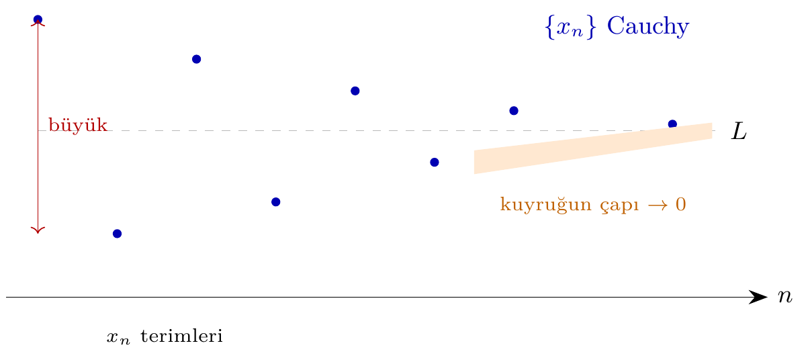
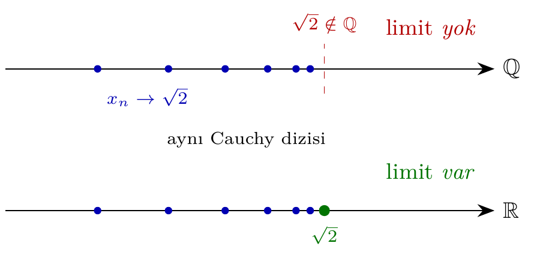
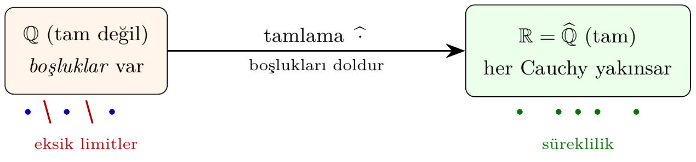

# Bölüm 15 — Metrik Tamlık ve Kompaktlık

Metrik tamlık (completeness), bir metrik uzayda Cauchy dizilerinin yakınsayıp
yakınsamadığını araştıran temel bir kavramdır. Tamamen sınırlılık ise kompaktlık
için anahtar bileşendir.

---

## 1. Konu

### Cauchy Dizisi ve Tamlık

Bir (M, d) metrik uzayında {x_n} dizisi **Cauchy** ise:

    ∀ε>0, ∃N∈ℕ: m,n≥N ⟹ d(x_m, x_n) < ε

(M, d) **tam (complete)** ise: Her Cauchy dizisi M'de bir limite yakınsır.



> 💡 **Sezgi:** Bir Cauchy dizisini, ilerledikçe birbirine sokulan bir terim
> kalabalığı gibi düşünün. İlk terimler birbirinden uzaktayken, yeterince
> ileri gidildiğinde tüm terimler bir noktada toplanır: "kuyruğun çapı"
> (`sup_{m,n≥N} d(x_m, x_n)`) sıfıra iner. Tam uzayda bu kalabalığın
> sıkıştığı yerde gerçekten bir nokta (limit) durur; tam olmayan uzayda ise
> o yerde bir **boşluk** olabilir.

### Tamamen Sınırlılık

A ⊆ M **tamamen sınırlı (totally bounded)** ise: her ε>0 için A'nın sonlu bir
ε-net (ε-kapsama) kümesi vardır.

    ε-net: S = {s_1,...,s_n} ⊆ M, her x∈A için ∃i: d(x,s_i) < ε

### Metrik Kompaktlık Karakterizasyonu

**(M, d) tam ∧ tamamen sınırlı ⟺ (M, d) kompakttır.** (Metrik uzaylarda.)

### Önemli Örnekler

| Uzay | Tam? | Tamamen sınırlı? | Kompakt? |
|------|------|-------------------|---------|
| ℝ (Öklid) | ✓ | ✗ | ✗ |
| [0,1] | ✓ | ✓ | ✓ |
| (0,1) | ✗ | ✓ | ✗ |
| ℚ (rasyoneller) | ✗ | ✗ | ✗ |
| Sonlu metrik | ✓ | ✓ | ✓ |



> ❌ **Karşı-örnek:** Rasyonel sayılar ℚ, Öklid metriğiyle **tam değildir**.
> `x_1 = 1`, `x_2 = 1.4`, `x_3 = 1.41`, `x_4 = 1.414`, ... dizisi √2'nin ondalık
> açılımıdır: her terim rasyoneldir ve dizi Cauchy'dir (`d(x_m, x_n) → 0`). Ama
> limit √2 ∉ ℚ olduğundan dizi ℚ içinde **hiçbir** noktaya yakınsamaz. Aynı dizi
> ℝ'de √2'ye yakınsar — fark uzayda "boşluk" olup olmamasıdır.

**Tamlama (completion).** Her metrik uzay (M, d) bir **tam** uzayın
(M̂, d̂) yoğun alt-uzayı olarak gömülebilir; M̂'ye M'nin *tamlaması* denir.
Sezgisel olarak tamlama, eksik limitleri ("boşlukları") ekleyerek uzayı
kapatır: ℝ = ℚ̂ bu inşanın klasik örneğidir.



> **Neden bu konu?** Cauchy dizileri tamlık için gerekli; tam olmayan uzaylarda yakınsama "dışarı kaçar".

> 🔍 **Kendin dene:** `closed_unit_interval_metric()` ve `real_line_metric()` için `is_complete` sonuçlarını karşılaştırın.

> ⚠️ **Sık hata:** Tamlık topolojik özellik değildir; (0,1) ~ ℝ homeomorf ama biri tam diğeri değil.

> ↗️ **Bkz.:** Bölüm 14 (metrik uzay tanımı), Bölüm 7 (kompakt metrik ⟹ tam).

> 💭 **Öz-yansıtma:** Baire kategorisi teoremi neden tam metrik uzaylar için geçerli?

---

## 2. Teoremler

**Teorem 2.1 (Heine-Borel Metrik Genelleştirmesi).**
Metrik uzayda kompaktlık ⟺ tamlık ∧ tamamen sınırlılık.

**Teorem 2.2 (Banach Sabit-Nokta Teoremi).**
(M, d) tam metrik uzay; T: M → M büzülme (Lipschitz sabiti < 1) ⟹
T'nin eşsiz bir sabit noktası var: T(x*) = x*.

> **İspat eskizi.** K < 1 büzülme sabiti olsun. Herhangi bir x_0 alıp
> x_{n+1} = T(x_n) iterasyonunu kurun. Büzülmeden
> `d(x_{n+1}, x_n) ≤ K · d(x_n, x_{n-1}) ≤ K^n · d(x_1, x_0)`. Üçgen
> eşitsizliği + geometrik seri ile `d(x_{n+m}, x_n) ≤ K^n/(1−K) · d(x_1, x_0)`;
> K < 1 olduğundan bu ifade n → ∞ iken sıfıra gider, yani {x_n} Cauchy'dir.
> **Tamlık** kullanılarak dizi bir x*'ye yakınsar. T sürekli (Lipschitz)
> olduğundan `T(x*) = T(lim x_n) = lim x_{n+1} = x*`: x* sabit noktadır.
> **Eşsizlik:** T(p) = p, T(q) = q olsaydı `d(p,q) = d(Tp,Tq) ≤ K·d(p,q)`,
> K < 1 ile bu ancak d(p,q) = 0, yani p = q ise mümkündür. ∎

**Teorem 2.3 (Tam Uzayın Kapalı Alt-Uzayı Tamdır).**
(M, d) tam ve A ⊆ M kapalı ise (A, d) de tamdır.

> **İspat eskizi.** {a_n} ⊆ A bir Cauchy dizisi olsun. {a_n} aynı zamanda
> M içinde Cauchy'dir ve M tam olduğundan bir a ∈ M limitine yakınsar. A
> **kapalı** olduğundan kendi limit noktalarını içerir; a_n → a ve a_n ∈ A
> olması a ∈ Ā = A demektir. Böylece her Cauchy dizisi A içinde bir limite
> yakınsar: A tamdır. ∎

**Teorem 2.4 (Baire Kategorisi Teoremi).**
Tam metrik uzay 1. kategoriden değildir: hiçbir zaman sayılabilir "ince" kümelerin
(hiçbiryerde-yoğun) birleşimi olamaz.

---

## 3. Algoritmalar

### Sonlu Metrikte is_complete

Sonlu metrik uzayda her Cauchy dizisi eninde sonunda sabit: trivially tam.
Algoritma: O(1).

### Sonlu Metrikte is_totally_bounded

Taşıyıcı kendisi ε-net oluşturur her ε>0 için: trivially tamamen sınırlı.
Algoritma: O(1).

### metric_compactness_check

```
MetricCompactnessCheck(M, d):
    complete <- is_complete(M, d)
    totally_bounded <- is_totally_bounded(M, d)
    return complete AND totally_bounded
```

Sonlu uzayda: her ikisi trivially true → otomatik kompakt.

---

## 4. pytop API

```python
from pytop.metric_spaces import FiniteMetricSpace
from pytop.metric_completeness import (
    is_complete,
    is_totally_bounded,
    metric_compactness_check,
    analyze_metric_completeness,
)
from pytop import real_line_metric, closed_unit_interval_metric
```

Tüm fonksiyonlar `Result` döner: `.status`, `.value`, `.justification`.

---

## 5. Örnekler

### Örnek 5.1 — Sonlu Metrik: Tam ve Kompakt

```python
from pytop.metric_spaces import FiniteMetricSpace
from pytop.metric_completeness import is_complete, is_totally_bounded, metric_compactness_check

points = ['A', 'B', 'C', 'D']
dist = {(a, b): (0 if a == b else 1) for a in points for b in points}
fms = FiniteMetricSpace(carrier=tuple(points), distance=dist)

print("is_complete:", is_complete(fms).status)
print("is_totally_bounded:", is_totally_bounded(fms).status)
mc = metric_compactness_check(fms)
print("metric_compactness_check:", mc.status, mc.value)
```

```text
is_complete: true
is_totally_bounded: true
metric_compactness_check: true True
```

### Örnek 5.2 — Kapalı [0,1]: Tam ve Kompakt

```python
from pytop import closed_unit_interval_metric

ui = closed_unit_interval_metric()
print("is_complete:", is_complete(ui).status)
print("is_totally_bounded:", is_totally_bounded(ui).status)
print("metric_compactness:", metric_compactness_check(ui).status)
```

```text
is_complete: unknown
is_totally_bounded: unknown
metric_compactness: unknown
```

Sembolik uzaylar için sonuç tag bilgisine göre `unknown` dönebilir.

### Örnek 5.3 — Gerçek Doğru ℝ: Tam, Kompakt Değil

```python
from pytop import real_line_metric

rl = real_line_metric()
print("is_complete:", is_complete(rl).status)
print("is_totally_bounded:", is_totally_bounded(rl).status)
print("metric_compactness:", metric_compactness_check(rl).status)
```

```text
is_complete: unknown
is_totally_bounded: unknown
metric_compactness: unknown
```

### Örnek 5.4 — analyze_metric_completeness

```python
from pytop.metric_completeness import analyze_metric_completeness

r = analyze_metric_completeness(fms)
print("status:", r.status)
print("value:", r.value)
```

```text
status: true
value: {'is_complete': True, 'is_totally_bounded': True, 'metric_compact': True}
```

### Örnek 5.5 — Öklid Metriki ile Karşılaştırma

```python
pts = list(range(5))
dist_eucl = {(a, b): abs(a - b) for a in pts for b in pts}
fms_e = FiniteMetricSpace(carrier=tuple(pts), distance=dist_eucl)

print("is_complete:", is_complete(fms_e).status)
print("is_totally_bounded:", is_totally_bounded(fms_e).status)
mc2 = metric_compactness_check(fms_e)
print("compactness:", mc2.status)
```

```text
is_complete: true
is_totally_bounded: true
compactness: true
```

### Örnek 5.6 — Rasyoneller ℚ: Tam Olmayan Uzay (Karşı-Örnek)

`rationals_metric()` sembolik bir uzaydır; `is_complete` ondalık taramayla karara
bağlanamadığı için `unknown` döner — fakat uzayın **etiketleri** (tags) ℚ'nun tam
olmadığını kayıt altına alır (`'not_complete'`).

```python
from pytop import rationals_metric
from pytop.metric_completeness import is_complete

qm = rationals_metric()
res = is_complete(qm)
print("is_complete:", res.status)
print("'not_complete' tag:", 'not_complete' in qm.tags)
print("justification:", res.justification[0])
```

```text
is_complete: unknown
'not_complete' tag: True
justification: Completeness has exact support only for explicit finite metric spaces.
```

√2'ye yakınsayan Cauchy dizisinin limiti ℚ'da bulunmaz: ℚ tam değildir. Kütüphane
sonlu metrik dışında "exact" karar vermez, ama küratörlü etiket bu gerçeği taşır.

### Örnek 5.7 — Banach ve Sabit-Nokta Profilleri

`get_fixed_point_profiles()` sabit-nokta teorisinin küratörlü profillerini verir;
`fixed_point_stability_summary()` bunları kararlılığa göre gruplar. Banach büzülme
teoremi **çekici (attracting)** sabit nokta profiline karşılık gelir.

```python
from pytop import get_fixed_point_profiles, fixed_point_stability_summary

profiles = get_fixed_point_profiles()
print("profil sayisi:", len(profiles))
for p in profiles:
    print(f"  {p.key:24s}: {p.stability}")

summary = fixed_point_stability_summary()
print("stable:", summary['stable'])
```

```text
profil sayisi: 5
  attracting_fixed_point  : stable
  repelling_fixed_point   : unstable
  neutral_fixed_point     : neutral
  brouwer_fixed_point     : not_applicable
  periodic_point_n        : not_applicable
```

```text
stable: ['attracting_fixed_point']
```

Banach teoreminin ürettiği sabit nokta `attracting_fixed_point` profilidir:
büzülme iterasyonu `x_{n+1} = T(x_n)` her başlangıçtan sabit noktaya yakınsar.

---

## 6. Alıştırmalar

### Kodlama

K1. Rasyonel sayılar ℚ (sembolik) için `is_complete` sonucunu kontrol edin.

K2. Kendi 4-noktalı metrik uzayınızı oluşturun ve `metric_compactness_check`
    uygulayın.

K3. `analyze_metric_completeness(fms)` çalıştırın ve `value` sözlüğünü inceleyin.

K4. `rationals_metric()` oluşturun; `is_complete(...).status` ile `'not_complete'`
    etiketinin uzayın `tags` kümesinde olup olmadığını yazdırın. Statü neden
    `unknown`, etiket neden `True`?

K5. `get_fixed_point_profiles()` listesini gezin ve `stability == 'stable'` olan
    profilin `key` alanını yazdırın. Bu profil hangi teoreme (Banach mı?) karşılık
    gelir?

### Teori

T1. Banach sabit-nokta teoremini sözlü olarak açıklayın ve bir uygulama örneği verin.

T2. Kapalı [0,1]'in tam olduğunu; açık (0,1)'in tam olmadığını gösterin.
    (Hint: 1/n dizisi Cauchy ama 0 ∉ (0,1).)

T3. "Tam uzayın kapalı alt-uzayı tamdır" teoremini ispatlayın. Ayrıca tam bir
    uzayda **açık** bir alt-uzayın tam olması gerekmediğini bir örnekle gösterin.
    (Hint: ℝ tam, ama (0,1) ⊆ ℝ açık ve tam değil.)

T4. ℚ'nun tam olmadığını √2'nin ondalık açılımı üzerinden ispatlayın: dizinin
    Cauchy olduğunu, fakat ℚ içinde limitinin bulunmadığını gösterin. Tamlama
    kavramıyla bu "boşluğun" nasıl kapatıldığını açıklayın.
